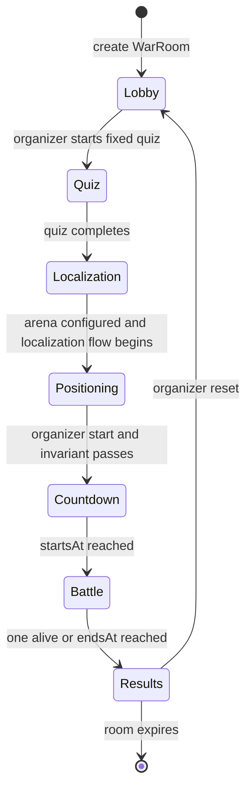
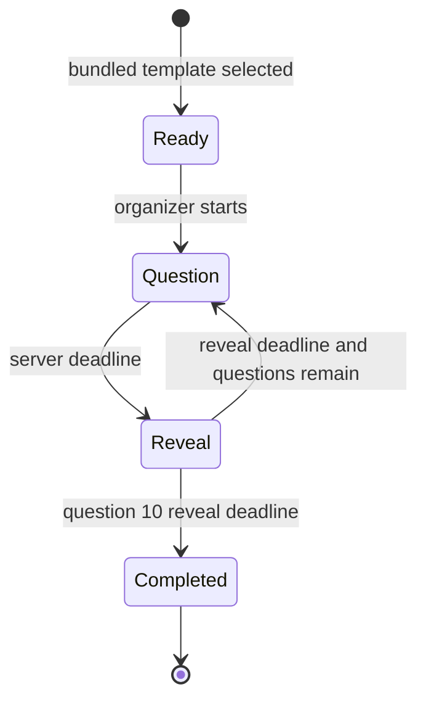
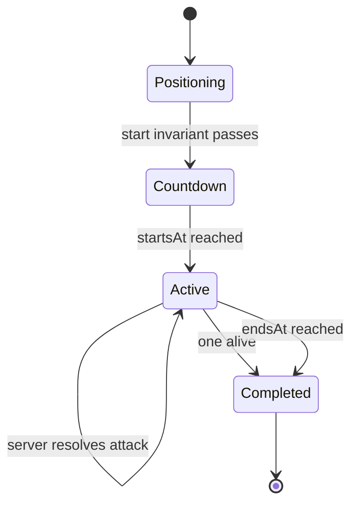
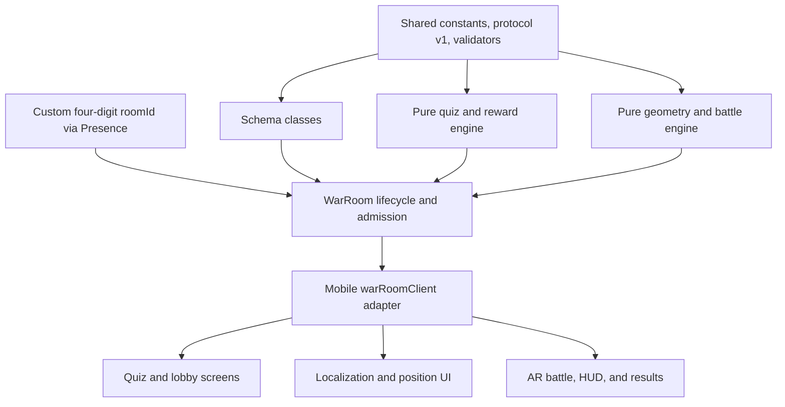

# CodexWars P0 — API and Realtime Specification

**Status:** Authoritative P0 interface contract
**Version:** 1.1
**Last updated:** 2026-07-14
**Applies to:** M1 hackathon vertical slice

This document defines how the mobile client and authoritative server collaborate for room admission, the quiz, localization, positioning, battle, results, and reconnection. It is subordinate to the active product and architecture decisions in:

- `PRD.md` v2.3
- `BUILD_SPEC.md` v1.3
- `ARCHITECTURE.md` v1.1

If this contract conflicts with one of those documents, stop implementation and resolve the documents together. Do not silently add a second source of truth.

---

## 1. P0 decisions this specification locks

1. **Nickname-only sessions.** P0 has no accounts, Firebase Authentication, bearer tokens, durable user IDs, or post-session history.
2. **Ephemeral live data.** Room, quiz, nickname, position, and battle data live in one Colyseus process and disappear when the room expires or the server restarts.
3. **One room identifier.** The unique four-digit Colyseus `roomId` is the public room code. There is no separate code-to-room registry.
4. **Colyseus owns admission.** The organizer uses the SDK create flow and participants use `joinById`. There are no custom P0 room-creation or seat-reservation HTTP endpoints.
5. **Server-owned authority.** A client may request an action, but cannot select its role, participant ID, rewards, position validity, hit target, damage, or winner.
6. **Organizer is separate.** One non-combat organizer exists outside the 12-participant capacity. `PlayerState` contains participants only.
7. **State is recovery truth.** Colyseus Schema state holds current truth. Messages are commands, acknowledgements, errors, and one-time effects.
8. **AR stays local.** The server receives marker-relative X/Z positions, coarse localization state, and an aim direction only when attacking. It never receives camera frames, Viro objects, continuous pose streams, or client-computed hits.
9. **One bundled P0 character.** Character and palette selection are P1. The server uses the fixed P0 avatar/loadout and does not expose a character-catalog API.
10. **No runtime cloud dependency.** Firebase scaffolding may remain in the repository for later work, but P0 admission, play, readiness, and results must work on an isolated organizer hotspot.

### 1.1 Changes from version 1.0

Version 1.0 predated the current product decisions. Version 1.1 removes mandatory Firebase auth and Firestore persistence, the custom admission HTTP service, the duplicate room-code registry, durable quiz result reads, and P1 character selection. It also aligns organizer modeling, round/event identifiers, tracking freshness, arena safety distances, reset behavior, and the implementation order with the active documents.

---

## 2. Topology and transport

### 2.1 P0 demo topology

```text
Android/iOS app ── Colyseus SDK over ws:// ── laptop-hosted Node/Colyseus process
                                           ├── WarRoom instances
                                           ├── bundled quiz template
                                           └── in-memory Presence/room state
```

The laptop and phones share a phone hotspot or local network. Internet access is not required. The mobile app stores the manually entered server base URL locally.

For a hosted product, TLS/WSS termination, WebSocket-aware ingress, process supervision, compatibility policy, metrics, abuse protection, and shared Presence/Driver must be designed explicitly. Replacing `ws://LAN-IP` with a public URL is not a complete M3 architecture.

### 2.2 Transport split

| Transport | P0 responsibility |
|---|---|
| HTTP | Operational liveness and readiness only |
| Colyseus matchmaking | Create a War Room, reserve/consume a seat, or join by `roomId` |
| Colyseus Schema | Recoverable synchronized room state |
| Colyseus messages | Validated commands, acknowledgements, errors, and transient effects |
| Local mobile storage | Server URL and the current short-lived reconnection token only |

There is no REST polling for lobby, quiz, positions, HP, results, or room discovery.

### 2.3 Operational HTTP

#### `GET /health`

Returns `200` when the process event loop can serve requests.

```json
{
  "status": "ok",
  "service": "codexwars-server",
  "protocolVersion": 1
}
```

This route must not depend on room count or any external service.

#### `GET /ready`

Returns `200` after Colyseus initialization and room registration complete; otherwise `503`.

```json
{
  "status": "ready",
  "protocolVersion": 1
}
```

P0 readiness has no Firebase/Firestore check.

---

## 3. Room admission and session authority

### 3.1 Organizer create flow

```ts
const room = await client.create("war", {
  protocolVersion: 1,
  displayName,
});
```

Server lifecycle:

1. Matchmaking constructs `WarRoom` and calls `onCreate`.
2. `onCreate` allocates an unused four-digit `roomId` and registers it through Colyseus Presence.
3. The first client admitted through the room's creation reservation is bound as the organizer. The client cannot set `role: "organizer"` in its payload.
4. `onJoin` records the organizer connection separately from participants.
5. The SDK returns the connected room, public `roomId`, and `reconnectionToken`.

The mobile app displays `room.roomId` as the join code.

### 3.2 Participant join flow

```ts
const room = await client.joinById(roomCode, {
  protocolVersion: 1,
  displayName,
});
```

Admission validates:

- `protocolVersion` is supported;
- `roomCode` resolves to an active War Room;
- the room is in `lobby` and accepting participants;
- participant count is below 12;
- nickname is normalized and valid; and
- the reservation has not already produced a participant record.

Duplicate nicknames are allowed. The server assigns a display suffix for the room projection, such as `Alex`, `Alex (2)`, while keeping the server-generated `playerId` as the real identifier.

### 3.3 What “authentication” means in P0

P0 has **session authentication**, not account authentication:

- Colyseus creates the session/seat identity.
- The server binds that session to exactly one room role and, for participants, one `playerId`.
- The short-lived reconnection token proves the right to resume that same session.
- Every handler looks up the server-bound role and player record; it never trusts a role or player ID supplied as authority by the client.
- Room expiry or server restart invalidates the whole session.

This protects organizer controls and participant ownership inside a live room without introducing student accounts or an internet dependency. It does not claim durable real-world identity or strong anti-cheat, both of which are P0 non-goals.

### 3.4 Room ID allocation

- Format: exactly four decimal digits, including leading zeroes.
- Allocation: generate cryptographically random candidates until Presence confirms the candidate is unused.
- Registration: add the selected ID to the Presence set before the room accepts joins.
- Disposal: remove it from Presence in `onDispose`.
- Exhaustion/collision retry has a bounded failure path and produces an operator-visible error.

With the single-process P0 deployment, the default in-memory Presence is sufficient. A horizontally scaled deployment requires shared Presence, normally Redis, before custom IDs are safe across processes.

### 3.5 Colyseus lifecycle, not custom admission HTTP

Colyseus already creates and consumes seat reservations for SDK `create`/`joinById` calls. A custom endpoint returning `consumeSeatReservation` data is unnecessary in P0 and would add another validation path, idempotency store, error model, and rate-limit surface.

Official references:

- [SDK matchmaking methods](https://docs.colyseus.io/client/)
- [Room lifecycle](https://docs.colyseus.io/server/room/)
- [Custom room ID recipe](https://docs.colyseus.io/recipes/custom-room-id)

---

## 4. Identifiers, time, ordering, and compatibility

```ts
type ProtocolVersion = 1;
type RoomId = string;       // four-digit public code and Colyseus roomId
type PlayerId = string;     // server-generated, room-scoped
type RoundId = number;      // starts at 1; increments on reset
type CommandId = string;    // client-generated UUID, unique per client/round
type EventSequence = number;// server-generated, monotonic within a round
```

### 4.1 Command envelope

All mutating in-room commands carry a `commandId`. Round-scoped commands also carry the current `roundId`.

```ts
type CommandMeta = {
  commandId: CommandId;
  roundId: RoundId;
};
```

The server keeps a bounded per-client, per-round deduplication cache. Receiving the same `commandId` again must not repeat a mutation. It returns the previous acknowledgement where practical; otherwise it returns `COMMAND_DUPLICATE` and relies on state reconciliation.

Reset increments `roundId`, clears command deduplication, and resets `eventSequence` to zero. A client ignores state-derived effects and events from an older round or an already-applied sequence.

### 4.2 Server time

`serverNow` is synchronized in room state at least once per second and on important transitions. Clients estimate `serverTimeOffset = serverNow - localNow` and render quiz/countdown/battle timers from server deadlines. A client clock never accepts a quiz answer, starts battle, resolves attack order, or ends a match.

### 4.3 Protocol compatibility

- P0 supports protocol version `1` only.
- Unsupported versions fail during matchmaking validation before an in-room record is created.
- Unknown fields on security- or authority-sensitive commands are rejected.
- Shared TypeScript types are compile-time help; server-side runtime validation remains mandatory.

---

## 5. Synchronized room state

The following are logical TypeScript projections. Implement them with Colyseus Schema classes and supported collection types, not literal plain objects.

### 5.1 Room state

```ts
type RoomPhase =
  | "lobby"
  | "quiz"
  | "localization"
  | "positioning"
  | "countdown"
  | "battle"
  | "results";

type OrganizerPublicState = {
  connected: boolean;
  displayName: string;
};

type WarRoomState = {
  protocolVersion: 1;
  roomId: RoomId;
  phase: RoomPhase;
  roundId: RoundId;
  eventSequence: EventSequence;
  serverNow: number;
  organizer: OrganizerPublicState;
  players: Map<PlayerId, PlayerPublicState>;
  arena: ArenaState;
  quiz: QuizPublicState;
  battle: BattleState;
};
```

The organizer is not inside `players`, does not have a combat position/stats, and does not consume the participant capacity.

### 5.2 Participant state

```ts
type PlayerPublicState = {
  playerId: PlayerId;
  displayName: string;
  connected: boolean;
  combatIncluded: boolean;

  quizCompleted: boolean;
  correctAnswers: number;       // finalized only after quiz completion
  hasAnsweredCurrent: boolean;  // never exposes optionId

  localization: "not_started" | "searching" | "localized" | "lost";
  positionLocked: boolean;
  positionX: number;
  positionZ: number;
  ready: boolean;

  characterId: "default";
  maxHp: number;
  hp: number;
  shield: number;
  weaponId: "bolt";
  charges: number;              // -1 represents unlimited
  nextAttackAt: number;
  eliminated: boolean;
  disconnectedAt: number;
};
```

Selected answers, unrevealed answer keys, reconnection tokens, raw join options, and diagnostic camera/pose data never enter synchronized state.

### 5.3 Quiz state

```ts
type QuizStatus =
  | "unconfigured"
  | "ready"
  | "question"
  | "reveal"
  | "completed";

type PublicQuizQuestion = {
  id: string;
  order: number;
  prompt: string;
  options: Array<{ id: string; label: string }>;
  difficulty: "basic" | "difficult";
  durationMs: number;
};

type QuizPublicState = {
  templateId: "programming-fundamentals-v1";
  status: QuizStatus;
  questionIndex: number;        // -1 before the first question
  questionCount: 10;
  currentQuestion?: PublicQuizQuestion;
  questionEndsAt: number;
  revealEndsAt: number;
  revealedCorrectOptionId: string; // empty during question
  revealedExplanation: string;     // empty during question
  submittedCount: number;
  eligibleCount: number;
};
```

The fixed template and answer key are bundled server data. They are validated at server startup and copied into private room quiz-engine state when selected. No live phase waits for a durable write.

### 5.4 Arena and battle state

```ts
type ArenaState = {
  radiusM: number;
  minimumSpacingM: 1.5;
  markerExclusionRadiusM: 0.75;
  configured: boolean;
};

type Standing = {
  rank: number;
  playerId: PlayerId;
  displayName: string;
  hp: number;
  shield: number;
  correctAnswers: number;
  eliminated: boolean;
};

type BattleState = {
  status: "not_started" | "countdown" | "active" | "completed";
  startsAt: number;
  endsAt: number;
  winnerId: PlayerId | "";
  completionReason: "" | "last_alive" | "timer";
  standings: Standing[];
};
```

All combat positions come from `players` where `combatIncluded && positionLocked`. There is no `get_all_positions` command.

---

## 6. Command handling rules

After a client has joined, every handler performs this order:

1. resolve the sender's server-bound room role/player record;
2. validate expected role;
3. validate current `roundId` and unseen `commandId`;
4. validate room/quiz/battle phase;
5. validate payload shape and bounds;
6. validate domain invariants;
7. mutate authoritative private/state data exactly once;
8. increment `eventSequence` for authoritative effects where required;
9. acknowledge the sender and/or broadcast an event.

Validation failure performs no partial mutation.

### 6.1 Organizer commands

#### `set_combat_included`

```ts
type SetCombatIncluded = CommandMeta & {
  playerId: PlayerId;
  included: boolean;
};
```

- Allowed in `lobby` before the quiz cohort freezes.
- Target must be a participant.
- Setting false clears localization, position, readiness, and combat state.
- Quiz-only participants still answer the quiz and count toward the 12-participant room capacity.

#### `configure_arena`

```ts
type ConfigureArena = CommandMeta & { radiusM: number };
```

- Allowed from `lobby` through `localization` and in `positioning` until any position is locked.
- Radius is finite and within 3–6 m.
- Minimum spacing is fixed at 1.5 m; marker exclusion is fixed at 0.75 m.

#### `select_quiz_template`

```ts
type SelectQuizTemplate = CommandMeta & {
  templateId: "programming-fundamentals-v1";
};
```

This is selection, not quiz authoring or persistence. The server copies the validated bundled template into private room state and publishes only its safe projection. P0 may default-select this template on room creation; keeping the explicit command supports the organizer flow without implying multiple templates.

#### `start_quiz`

```ts
type StartQuiz = CommandMeta;
```

Requirements: `lobby`, template ready, organizer connected, and at least one participant. The server freezes the cohort, enters `quiz`, publishes question 1 without its answer key, sets the authoritative deadline, and automatically runs all ten question/reveal intervals.

#### `start_battle`

```ts
type StartBattle = CommandMeta;
```

Allowed only in `positioning`. Every combat-included participant must be:

```text
connected
AND quizCompleted
AND localization == localized
AND positionLocked
AND ready
AND not eliminated
```

Quiz-only participants never block the start. On success, the server initializes combat from fixed rules, sets `phase=countdown`, sets `startsAt=now+5_000`, sets `endsAt=startsAt+60_000`, and transitions once to `battle` at `startsAt`.

Failure returns all blockers to the organizer as player IDs plus stable reason codes.

#### `reset_round`

```ts
type ResetRound = CommandMeta;
```

- Allowed only in `results`.
- Retains connected room members, display names, and server-bound roles.
- Increments `roundId`.
- Clears quiz answers/scores/rewards, localization, positions, readiness, combat state, command-deduplication state, and per-round `eventSequence`.
- Returns to `lobby`; no previous-round data remains available after reset.

### 6.2 Participant commands

#### `quiz_answer`

```ts
type QuizAnswerCommand = CommandMeta & {
  questionId: string;
  optionId: string;
};
```

Acceptance requires the sender to belong to the frozen cohort, quiz status `question`, matching current `questionId`, valid public option ID, server receipt strictly before `questionEndsAt`, and no previously accepted answer from that player for the question.

On acceptance, the server stores the option and receipt time in private in-memory quiz state, flips `hasAnsweredCurrent`, increments `submittedCount`, and sends `quiz_answer_accepted` only to the sender. Correctness remains private until reveal. Missing answers score zero.

#### `localization_changed`

```ts
type LocalizationChanged = CommandMeta & {
  state: "searching" | "localized" | "lost";
};
```

- Allowed for combat-included participants during `localization` and `positioning`.
- During countdown/battle, the server accepts only coarse tracking status updates needed for readiness/fire gating; it never accepts a pose stream.
- Before countdown, `lost` clears readiness.
- During battle, `lost` retains the locked position and the match continues. The client disables firing when it has no fresh usable aim and prompts for re-scan.

The server cannot independently prove the age of an unstreamed local AR pose. P0 therefore enforces freshness at the AR/client boundary and treats `localization: lost` as an additional server-side attack rejection. This is honest session integrity, not full anti-cheat.

#### `lock_position`

```ts
type LockPosition = CommandMeta & { x: number; z: number };
```

Validation:

- phase `positioning`;
- combat-included participant and localization `localized`;
- finite marker-relative metre coordinates;
- radial distance is at least 0.75 m from the marker;
- radial distance is at most configured arena radius; and
- distance from every other locked combat participant is at least 1.5 m.

The server rejects Y, camera transforms, latitude/longitude, GLB transforms, or client claims that a position is valid.

Position rejections include machine-readable directional guidance:

```ts
type PositionErrorDetails = {
  correction: { x: number; z: number }; // shortest safe displacement vector
  distanceM: number;                    // magnitude of correction
  conflictsWithPlayerId?: PlayerId;
};
```

#### `unlock_position`

```ts
type UnlockPosition = CommandMeta;
```

Allowed only in `positioning`; clears locked position and readiness.

#### `ready_changed`

```ts
type ReadyChanged = CommandMeta & { ready: boolean };
```

Setting true requires quiz completion, localization `localized`, and a valid locked position. Setting false is allowed until countdown begins.

#### `attack`

```ts
type AttackCommand = CommandMeta & {
  weaponId: "bolt";
  dirX: number;
  dirZ: number;
  predictedTargetId?: PlayerId; // diagnostics only
};
```

Validation at server receipt:

- current round and unseen command;
- `phase=battle`, battle active, and `startsAt <= now < endsAt`;
- sender connected, combat-included, alive, positioned, and localization not `lost`;
- finite direction with sufficient horizontal magnitude, normalized server-side;
- fixed server-owned bolt loadout, cooldown elapsed, and charge rule satisfied.

Resolution:

1. Use the sender's locked position as the ray origin.
2. Use server-normalized `(dirX, dirZ)` as direction.
3. Test eligible opponents as 2D circles using server-owned hit radius.
4. Select the nearest valid ray-circle intersection within range.
5. Apply shield before HP, clamp values, and eliminate at zero HP.
6. Increment `eventSequence`, patch state, and emit `attack_resolved`.
7. Emit `player_eliminated` once if required, with its own next sequence.
8. Evaluate last-alive completion after mutation.

`predictedTargetId`, pitch, mesh height, bones, animations, and projectile visuals never affect the result.

---

## 7. Events, acknowledgements, and errors

Schema state is the recovery source of truth. Events exist for request feedback and one-time UI/audio/haptic effects.

### 7.1 Common envelope

```ts
type EventMeta = {
  roundId: RoundId;
  eventSequence: EventSequence;
  serverNow: number;
};

type CommandAccepted = {
  roundId: RoundId;
  commandId: CommandId;
  command: string;
  serverNow: number;
};

type ServerError = {
  roundId: RoundId;
  commandId?: CommandId;
  code: ErrorCode;
  message: string;
  retryable: boolean;
  details?: unknown;
};
```

Messages never use stack traces or raw dependency errors as client-facing text.

### 7.2 Quiz events

```ts
type QuizQuestionStarted = EventMeta & {
  questionId: string;
  questionIndex: number;
  questionEndsAt: number;
};

type QuizAnswerAccepted = {
  roundId: RoundId;
  commandId: CommandId;
  questionId: string;
  acceptedAt: number;
};

type QuizQuestionRevealed = EventMeta & {
  questionId: string;
  correctOptionId: string;
  explanation: string;
  revealEndsAt: number;
};

type QuizAnswerResult = {
  roundId: RoundId;
  questionId: string;
  selectedOptionId?: string;
  correct: boolean;
  runningCorrectAnswers: number;
};

type QuizCompleted = {
  roundId: RoundId;
  correctAnswers: number;
  questionCount: 10;
  startingShield: number;
};
```

Answer result and quiz completion are sent privately to their participant. Organizer-visible completion and finalized totals are state.

### 7.3 Battle events

```ts
type BattleCountdownStarted = EventMeta & {
  startsAt: number;
  endsAt: number;
};

type AttackResolved = EventMeta & {
  commandId: CommandId;
  attackerId: PlayerId;
  targetId: PlayerId | null;
  damage: number;
  targetShield: number | null;
  targetHp: number | null;
};

type PlayerEliminated = EventMeta & {
  playerId: PlayerId;
  eliminatedByPlayerId: PlayerId | null;
};

type BattleCompleted = EventMeta & {
  winnerId: PlayerId;
  reason: "last_alive" | "timer";
  standings: Standing[];
};
```

Clients apply an event effect only when `roundId` matches and `eventSequence` is newer than the last applied sequence. HP, shield, elimination, timer, and winner UI always reconcile to Schema state.

---

## 8. State machines

### 8.1 Room phase



### 8.2 Quiz



Rules:

1. Only one public question projection exists at a time.
2. Each participant submits once; peers see aggregate count and their own boolean, never another option.
3. Server deadlines advance despite disconnected/silent participants.
4. Correctness stays private until reveal.
5. Missing answers score zero.
6. Completion derives deterministic shield rewards and moves directly to localization.
7. Reconnect restores the question, deadline, submission boolean, and public phase from state.

### 8.3 Battle



Timer completion ranks by remaining HP, then quiz score, then stable `playerId` ordering. The final fallback prevents winner selection from depending on map iteration order. Results remain only until reset or room expiry.

---

## 9. Reconnection, disconnects, and expiry

### 9.1 Reconnection flow

The mobile adapter retains `room.reconnectionToken` only for the active session and calls the Colyseus reconnect flow after an unintentional drop. On successful `onReconnect`, the server reattaches the connection to the same organizer/player record and sends current state.

The client must distinguish:

- transient network loss: attempt reconnection;
- explicit leave: do not auto-reconnect;
- expired token/room not found/server restart: clear the token and show “Session ended — return home or rejoin with a code.”

Do not log or include reconnection tokens in analytics, errors, or synchronized state.

### 9.2 Participant disconnect policy

- Before battle: retain the participant record and mark `connected=false`; readiness becomes false. The organizer can continue once they return or exclude them from combat.
- During countdown/battle: retain position, HP, shield, and cooldown for 20 seconds.
- Reconnect within 20 seconds: reattach unchanged state.
- Grace expiry during battle: eliminate exactly once and broadcast the authoritative result.

### 9.3 Organizer disconnect policy

- Before countdown: keep the phase unchanged and disable organizer-only commands for 60 seconds. Grace expiry closes the in-memory room.
- During countdown/battle: timers and combat continue; organizer controls remain unavailable until reconnection.
- The organizer role never transfers automatically to a participant in P0.

### 9.4 Room expiry and restart

Rooms expire after two hours of inactivity or the organizer pre-battle grace policy. A process restart ends every room. P0 deliberately provides no room resurrection or durable result recovery.

---

## 10. Error catalogue

Matchmaking errors are translated by `warRoomClient.ts` into the same app-level error shape used for room messages.

| Code | Surface | Meaning | Retryable |
|---|---|---|---|
| `CLIENT_VERSION_UNSUPPORTED` | Matchmaking | Protocol mismatch | No; update app |
| `ROOM_NOT_FOUND` | Matchmaking | No active room has that ID | No; check code |
| `ROOM_NOT_JOINABLE` | Matchmaking | Room is not accepting participants | No |
| `ROOM_FULL` | Matchmaking | 12 participants already admitted | No |
| `NICKNAME_INVALID` | Matchmaking | Nickname violates normalization/length rules | No |
| `SESSION_EXPIRED` | Reconnect | Token or room no longer exists | No; return home |
| `ROLE_FORBIDDEN` | Message | Server-bound role cannot perform command | No |
| `ROUND_MISMATCH` | Message | Command belongs to another round | No; resync |
| `COMMAND_DUPLICATE` | Message | Command already processed | No action needed |
| `PHASE_MISMATCH` | Message | Command is illegal in current phase | Usually no |
| `QUIZ_NOT_READY` | Message | Quiz start precondition failed | Yes |
| `QUESTION_MISMATCH` | Message | Answer references another question | No |
| `ANSWER_OPTION_INVALID` | Message | Option is not on current question | No |
| `ANSWER_DUPLICATE` | Message | Answer already accepted | No action needed |
| `ANSWER_LATE` | Message | Received at/after deadline | No |
| `ARENA_RADIUS_INVALID` | Message | Radius outside 3–6 m | No |
| `NOT_LOCALIZED` | Message | Action requires usable localization | Yes |
| `POSITION_INVALID` | Message | Coordinates malformed/non-finite | No |
| `POSITION_IN_MARKER_EXCLUSION` | Message | Inside 0.75 m exclusion | Yes after movement |
| `POSITION_OUT_OF_BOUNDS` | Message | Outside arena radius | Yes after movement |
| `SPACING_VIOLATION` | Message | Less than 1.5 m from locked player | Yes after movement |
| `BATTLE_START_BLOCKED` | Message | Start invariant failed | Yes |
| `ATTACK_NOT_ALLOWED` | Message | Wrong phase, dead, disconnected, or tracking lost | Temporary/no |
| `ATTACK_COOLDOWN` | Message | Fired before `nextAttackAt` | Yes |
| `ATTACK_DIRECTION_INVALID` | Message | Direction cannot be normalized | Yes |
| `WEAPON_INVALID` | Message | Weapon differs from fixed loadout | No |
| `RATE_LIMITED` | Message | Raw command attempt limit exceeded | Yes |

P0 has no auth-token, template-storage, or persistence-unavailable errors because those services are not in its runtime path.

---

## 11. Abuse controls, payload limits, and logs

The LAN demo does not need internet-grade account abuse controls, but it still needs bounded input:

- Matchmaking create/join: small per-IP burst limit at the HTTP/WebSocket edge when hosted; local demo defaults must not lock out a 12-device rehearsal.
- `quiz_answer`: one accepted answer per participant/question; cap malformed attempts.
- Localization, position, and readiness commands: maximum 5/s per client.
- `attack`: weapon cooldown is authoritative; cap raw attempts at 10/s and disconnect persistent abuse.
- Maximum room command payload: 2 KiB.
- Display names are normalized, rendered as text, never used as identifiers, and suffixed server-side on duplicates.
- Logs use correlation ID, hashed room ID, player ID, event type, and stable error code.
- Logs redact nicknames, reconnection tokens, answer choices, and coordinates by default.

Room-code enumeration resistance becomes important for an internet-hosted product. Four decimal digits are a convenience code, not a security boundary; M3 must add explicit hosted threat modeling before pilots.

---

## 12. Module boundaries

The P0 design keeps two deep pure domain modules and one network orchestrator:

```ts
interface QuizEngine {
  configure(template: QuizTemplate, cohort: Cohort): QuizTransition;
  start(now: number): QuizTransition;
  submit(playerId: PlayerId, answer: AnswerInput, receivedAt: number): QuizTransition;
  advance(now: number): QuizTransition;
}

interface BattleEngine {
  start(players: BattlePlayer[], now: number): BattleTransition;
  attack(playerId: PlayerId, input: AttackInput, receivedAt: number): BattleTransition;
  expire(now: number): BattleTransition;
}
```

`WarRoom` owns lifecycle, server-bound roles, phase authorization, timers, deduplication, reconnection, Schema projection, and event emission. It invokes pure quiz, reward, geometry, and battle logic from `packages/shared`.

The fixed quiz and fixed character/loadout are bundled modules, not repository/catalog interfaces. P0 has only one implementation of each, so a `QuizRepository`, `CharacterCatalog`, or `RoomAdmission` abstraction would be a speculative middle layer. Add a port when a real second source or remote system is approved:

- authored/durable quiz storage in P2;
- multiple character definitions in P1;
- hosted identity/abuse controls in P2/M3; or
- external admission/business policy in a hosted architecture.

When durable quiz storage is approved, place it behind an explicit server-owned port and keep Firestore details out of `WarRoom` and shared domain types. Do not reactivate existing Firebase scaffolding merely because it exists.

On mobile, `lib/warRoomClient.ts` is the only `@colyseus/sdk` importer. It exposes app-level create/join/reconnect/send/subscribe methods and translates transport errors. AR code remains behind `ArSessionState`/`ArPose` and never imports the network client.

---

## 13. Implementation dependency graph and order



Execution order:

1. Lock the Colyseus server/client/testing dependency pair already selected in `BUILD_SPEC.md`.
2. Add protocol v1 types, runtime validators, constants, reward rules, and pure 2D combat/geometry functions to `packages/shared`.
3. Implement Schema classes and serialization tests, including answer-key and token leak tests.
4. Replace the plain HTTP bootstrap with Colyseus `defineServer`, retaining `/health` and `/ready`.
5. Implement custom four-digit `roomId` allocation/release through Presence.
6. Implement SDK create/join-by-ID integration, server-bound roles, participant capacity, nickname suffixing, and reconnect reattachment.
7. Implement `WarRoom` phases, authorization, command deduplication, event ordering, clock sync, organizer policy, and expiry.
8. Implement the bundled Quiz Engine, automatic timers, reveal, scoring, and shield rewards entirely in memory.
9. Implement arena configuration, tracking status, marker exclusion, locked-position validation, correction vectors, and state sync.
10. Implement Battle Engine, countdown, attack resolution, disconnect elimination, deterministic winner, and reset.
11. Implement `warRoomClient.ts` and state subscriptions before feature screens.
12. Build lobby/quiz UI, then localization/minimap, then AR battle/HUD/results.
13. Run two-client, 12-client, reconnect, server-restart, and mixed Android/iOS rehearsals.

Firebase token verification, Firestore repositories, a code registry, custom seat-reservation endpoints, and character catalog/rules HTTP endpoints are not P0 dependencies.

---

## 14. Required tests

### 14.1 Contract and privacy

- Every command/event validates at runtime.
- Unknown authority-sensitive fields reject.
- Protocol mismatch fails before a room member record is created.
- Schema snapshots contain no role claim input, token, selected answer, unrevealed answer key, or AR pose.
- P0 server boots and completes a round with no internet/Firebase configuration.

### 14.2 Matchmaking and session authority

- Organizer SDK create returns a room whose four-digit `roomId` is joinable with `joinById`.
- Concurrent room creation never allocates the same active ID.
- Disposal releases the ID.
- Correct code joins; invalid code fails cleanly.
- Participant 13 is rejected; organizer does not consume participant capacity.
- Duplicate nicknames receive deterministic suffixes.
- Duplicate join/retry does not create duplicate player records.
- A participant cannot obtain organizer authority through payload/message tampering.
- No custom code registry or admission HTTP route is required for the flow.

### 14.3 Quiz

- Bundled template validates exactly ten questions at startup.
- Start freezes the cohort.
- Receipt before deadline accepts; exact deadline rejects.
- Duplicate semantic answer and duplicate `commandId` cannot score twice.
- Correct answer never leaks before reveal.
- Missing/disconnected answer scores zero and timers advance.
- Shield bands match all scores 0–10.
- Quiz completion advances without a persistence dependency.
- Reconnect restores current question, deadline, and own accepted-answer boolean.

### 14.4 Positioning and battle

- Arena radius boundaries, 0.75 m marker exclusion, and 1.5 m spacing boundaries.
- Rejection correction vector is finite, points toward a valid location, and has the stated magnitude.
- Quiz-only participant never blocks start and has no position.
- Start error reports every blocker.
- Same floor direction produces the same hit regardless of camera pitch/GLB height.
- Nearest of two aligned eligible opponents is hit.
- Shield absorbs before HP; overflow reaches HP.
- Duplicate attack command cannot apply damage twice.
- Cooldown, eliminated, pre-start, post-end, tracking-lost, and malformed attacks reject.
- HP zero eliminates once and produces ordered events.
- Last-alive and timer results are deterministic, including exact ties.
- Reset increments `roundId` and removes every previous-round field/dedup entry.

### 14.5 Reconnection, performance, and devices

- Participant reconnect within 20 seconds restores state; timeout eliminates once.
- Organizer reconnect within pre-battle 60 seconds restores controls; timeout closes room.
- Server restart produces explicit session-ended UX rather than infinite reconnect.
- Missed/duplicate events recover from Schema state and ordering fields.
- Twelve participants can answer near the same deadline.
- Twelve-player battle at maximum allowed attack rate stays within the 10 Hz patch budget.
- Android and iOS reconnect on the recommended hotspot topology.
- Same locked positions render consistently on Android and iPhone.
- AR sends no continuous pose/aim traffic; stale pose disables firing within one second.

---

## 15. Capability-to-interface checklist

| Product capability | P0 interface |
|---|---|
| Organizer creates room | `client.create("war", options)` |
| Participant joins | `client.joinById(roomId, options)` |
| Resume dropped session | Colyseus reconnect token + room lifecycle |
| Organizer selects fixed quiz | `select_quiz_template` |
| Organizer starts quiz | `start_quiz` |
| Participant receives questions | `QuizPublicState.currentQuestion` |
| Participant answers/checks | `quiz_answer`, private acknowledgement/result, public reveal |
| Get quiz result/reward | Current room state + private `quiz_completed`; no durable history |
| Use P0 character/stats | Fixed shared constants + `PlayerPublicState`; no catalog API |
| Configure arena | `configure_arena` |
| Get all participant positions | `RoomState.players` Schema patches |
| Organizer starts battle | `start_battle`, state `startsAt`, countdown event |
| Participant attacks | `attack` |
| Resolve hit/HP/elimination | State patches + ordered battle events |
| Get winner/results | `BattleState` + `battle_completed` |
| Run another round | `reset_round` |

---

## 16. Current implementation gap

At the time of this revision, the repository contains partial scaffolding, including a plain health server, Firebase-related helpers/repository work, the demo quiz, shared types, and mobile AR/GLB work. Presence of code is not the same as approved P0 runtime architecture.

The target P0 path still requires the Colyseus dependency/bootstrap, Schema state, custom `roomId`, SDK create/join/reconnect integration, `WarRoom`, complete runtime validators, quiz timers, arena/position rules, battle logic, ordering/deduplication, and realtime integration tests.

Existing Firebase code must remain disconnected from P0 startup/admission/gameplay or be removed in a separate cleanup. It must not make `/ready`, quiz progression, or results depend on internet access. Future persistence requires an explicit P2 product decision and a new architecture review.
