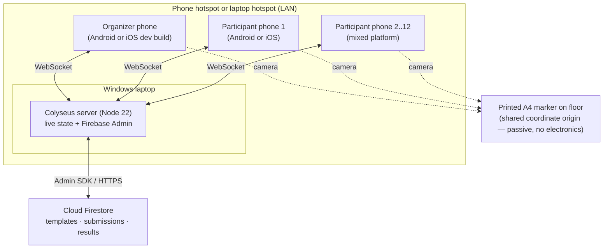
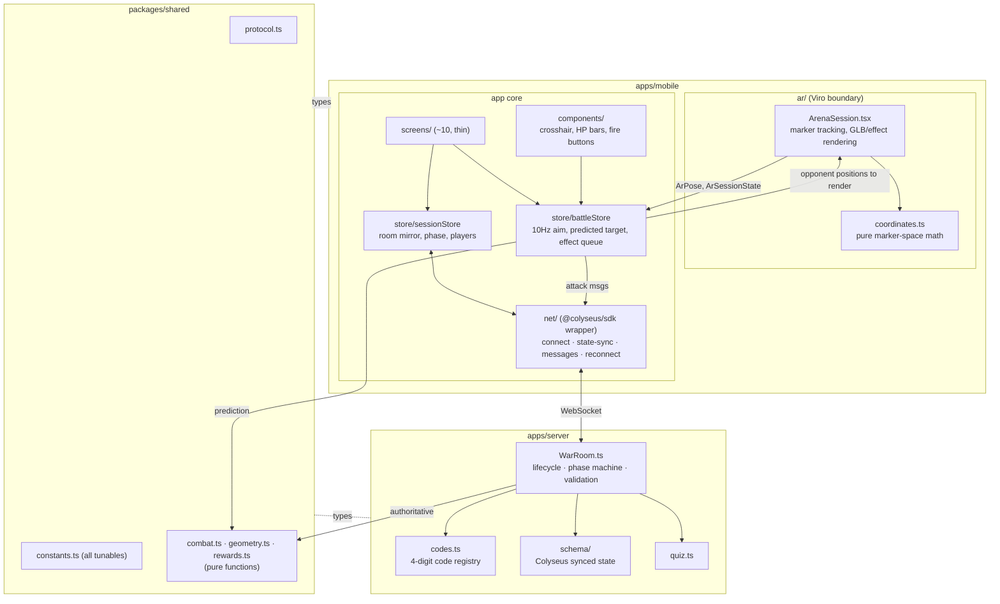
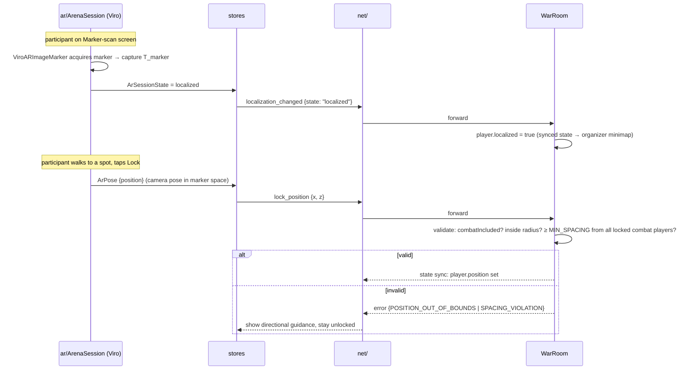
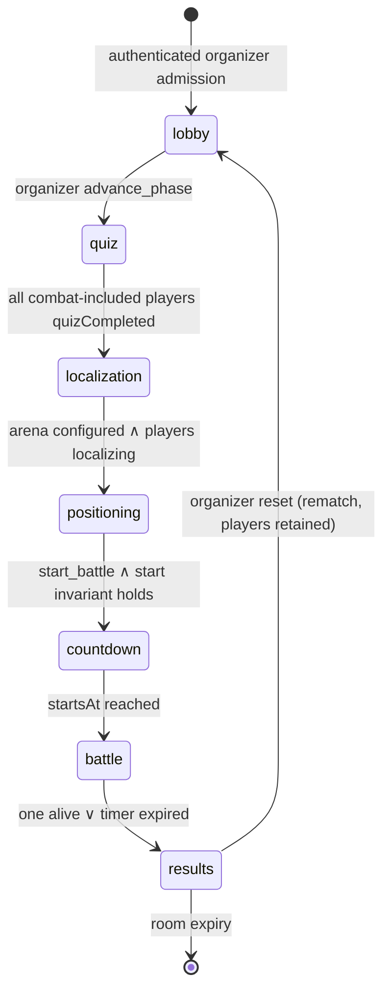
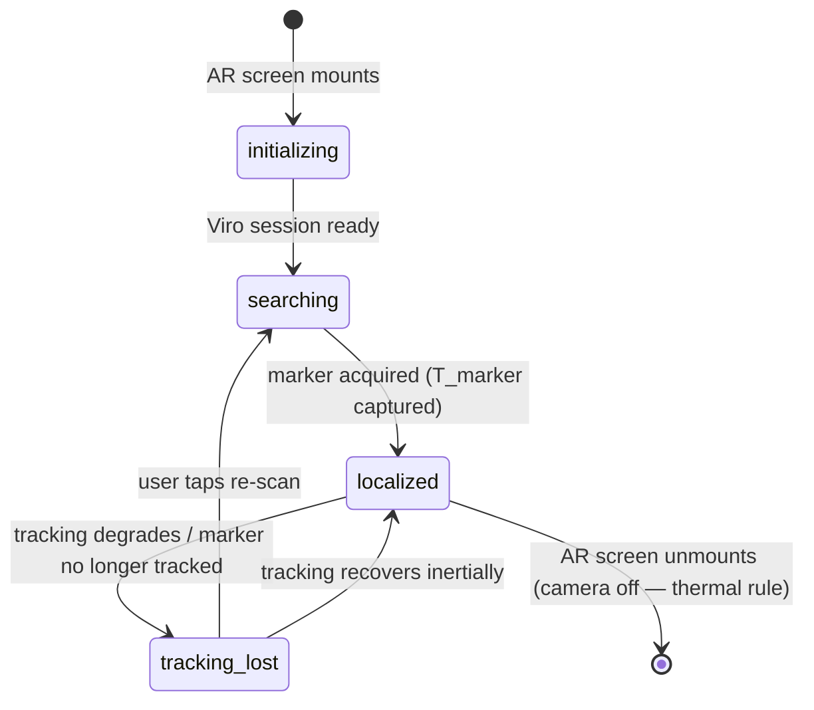

# CodexWars — Architecture Design

**Version:** 1.0
**Companions:** `PRD.md` v2.2 (what & why) · `BUILD_SPEC.md` v1.2 (stack, repo layout, build order)
**This document:** the structural and runtime design — components, deployment, critical sequences, state machines, and invariants. Diagrams here are the reference during implementation; if code and this doc disagree, fix one of them in the same commit.

---

## 1. Architecture at a glance

Three layers, one hard rule per boundary:

| Layer | Owns | Hard rule |
|---|---|---|
| **AR presentation** (`mobile/src/ar/`) | Marker tracking, coordinate conversion, rendering bundled GLBs/effects in camera space | Only place Viro is imported. Publishes plain 2D data; never touches the network. |
| **Game client** (`mobile/src/{screens,store,net,lib/firebase}`) | UI, local state, Colyseus connection, anonymous Firebase identity | Never imports Viro types or Admin credentials. Treats AR as a sensor behind the `ArSessionState`/`ArPose` contract. |
| **Authoritative server** (`server/`) | Rooms, phase machine, validation, combat, results, Firestore quiz persistence | Never knows AR exists. Consumes marker-relative 2D coordinates as opaque numbers. |

All three compile against `packages/shared` (types, protocol, constants, pure game math). The math is written once and executed in two places: the server uses it authoritatively; the client uses the same functions for prediction (crosshair target highlight), which is why predicted and actual results almost always agree.

---

## 2. Deployment view

### Demo / development topology (M0–M2)



Properties: one Wi-Fi hop between every phone and the server. Firestore is the only cloud dependency and stores quiz data only; the marker remains the shared spatial infrastructure and is a piece of paper.

### Product topology (M3+)
Identical, except the Colyseus server moves to a small VPS/PaaS node and phones reach it over the internet. Nothing in the code changes but the URL — this is deliberate (BUILD_SPEC §11).

---

## 3. Component view



Dependency direction is strictly downward into `shared`; `shared` imports nothing from anywhere (zero runtime deps — enforced in its `package.json`).

---

## 4. Runtime sequences (the four that matter)

### 4.1 Localization and position lock



### 4.2 Attack resolution (the core loop)

```mermaid
sequenceDiagram
    participant HUD as HUD (fire button)
    participant B as battleStore
    participant N as net/
    participant SRV as WarRoom
    participant ALL as all clients

    Note over B: ar/ publishes ArPose at ~10Hz continuously
    HUD->>B: fire pressed
    B->>B: read latest aimDir; run shared resolveAttack for prediction
    Note over B: project camera forward onto X/Z; discard vertical pitch
    B->>N: attack {weapon, dirX, dirZ, predictedTargetId}
    N->>SRV: forward
    SRV->>SRV: validate at server receipt: phase=battle, now≥startsAt,<br/>alive, cooldown elapsed, charges>0, |dir|≈1
    SRV->>SRV: resolveAttack(attacker, dir, weapon, players)  ← shared/combat.ts
    SRV->>SRV: applyDamage: shield → HP → clamp → eliminated?
    SRV->>ALL: attack_resolved {attackerId, targetId|null, damage, targetShield, targetHp}
    opt target reached 0 HP
        SRV->>ALL: player_eliminated {playerId}
        SRV->>SRV: checkWinner → maybe battle_completed
    end
    ALL->>ALL: HUD update + AR effect (projectile/flash toward target position)
```

Latency budget: one client→server hop + broadcast on LAN ≈ 5–30 ms; the ≤250 ms responsiveness target (PRD §9) has an order-of-magnitude margin on the demo topology.

### 4.3 Battle start (synchronized countdown)

```mermaid
sequenceDiagram
    participant ORG as Organizer client
    participant SRV as WarRoom
    participant ALL as all clients

    ORG->>SRV: start_battle
    SRV->>SRV: check start invariant for every combat-included participant:<br/>connected ∧ localized ∧ quizCompleted ∧ position≠null ∧ ready
    alt invariant fails
        SRV-->>ORG: error {NOT_READY, blockers: [playerIds]}
    else ok
        SRV->>SRV: phase=countdown; startsAt = serverNow + COUNTDOWN_MS
        SRV->>ALL: state sync {phase, startsAt, serverNow}
        ALL->>ALL: render countdown from startsAt using calculated server-time offset
        SRV->>SRV: at startsAt: phase=battle; arm battle timer
    end
```

Clients never count down from a local "5"; they render `startsAt − (localNow + serverTimeOffset)`, so a phone that receives the sync late still agrees on the start instant.

### 4.4 Disconnect and reconnect

```mermaid
sequenceDiagram
    participant P as Participant phone
    participant SRV as WarRoom

    P--xSRV: transport drop (WiFi blip)
    SRV->>SRV: onDrop: player.connected=false, PlayerState retained
    alt phase = battle
        SRV->>SRV: start DISCONNECT_ELIMINATION_MS timer (20s)
    end
    alt reconnects in time (@colyseus/sdk auto-reconnection)
        P->>SRV: reconnect with session token
        SRV->>SRV: onReconnect: reattach to same PlayerState, connected=true
        SRV-->>P: full state sync (position, HP, charges intact)
        Note over P: if AR session survived, resume battle;<br/>else prompt marker re-scan (position is server-held, not lost)
    else timer expires during battle
        SRV->>SRV: eliminate player, broadcast player_eliminated
    end
```

Key property: **position, HP, and rewards live on the server**, so a phone reboot mid-session loses only the AR localization (recoverable by re-scanning the marker) — never the player's game state.

---

## 5. State machines

### 5.1 Room phases (server-owned; the master clock of a session)



Every inbound message is gated on phase (BUILD_SPEC §8.2); anything else is a typed `error`, never a state change.

### 5.2 AR session (client-owned, per phone)



Only transitions in/out of `localized` are reported to the server. Before countdown, loss clears readiness. During P0 battle, the client keeps the last valid transform, shows a re-scan prompt, and does not pause the shared match; organizer-controlled pause is P1.

### 5.3 Player lifecycle (server-owned, per participant)

```
joined → quiz_done → localized → positioned → ready ──battle──► alive ─┬─► eliminated → P0 eliminated overlay
   quiz_only ─────────────────────────────────────────────────────────────┘
   (any state) ⇄ disconnected(grace) — state retained, timers per §4.4  └─► winner
```

---

## 6. Data & coordinate architecture

### 6.1 Coordinate spaces
1. **Device-local AR space** — each phone's private Viro world; arbitrary origin; never leaves `ar/`.
2. **Marker space** — the shared 2D floor frame: origin at the printed marker's center, axes from its orientation (asymmetric marker ⇒ unambiguous). All network coordinates are marker-space `(x, z)` metres. Conversions (`coordinates.ts`, from BUILD_SPEC §9.3): position lock = `inverse(T_marker) × cameraPose`; rendering = `T_marker × [x, AVATAR_HEIGHT_M, z]`.
3. **Server space** — identical to marker space; the server just does 2D geometry on the numbers.

Y is discarded at the `ar/` boundary. There is no coordinate translation on the server, no per-device calibration data to sync, and no shared state beyond what Colyseus already syncs.

### 6.2 State ownership (single-writer rule)

| Data | Written by | Read by |
|---|---|---|
| Phase, `startsAt`, `serverNow`, combat inclusion, positions, HP/shield/charges, eliminations, winner | **Server only** | all clients via state sync |
| Localization status, ready flag, quiz answers, attack commands | Owning client (as *requests*) | server validates, then owns the result |
| Combat inclusion | Organizer (as a request) | server validates, then owns the result |
| Live aim pose, predicted target, effect animations | Owning client only | never networked (aim ships only inside discrete `attack` messages) |

This is why bandwidth stays trivial: continuous data (aim at 10 Hz) never crosses the network; only button presses and server verdicts do.

---

## 7. Cross-cutting invariants

Checked in code review and, where possible, by tests:

1. **I-1** No import of `@reactvision/react-viro` outside `apps/mobile/src/ar/` (lint rule).
2. **I-2** No import of anything from `apps/` inside `packages/shared`; `shared` has zero runtime dependencies.
3. **I-3** Every gameplay number lives in `shared/constants.ts` — no magic numbers in room or component code.
4. **I-4** The server never reads `predictedTargetId` for resolution (diagnostics logging only).
5. **I-5** Every client→server message handler: phase gate → payload validation → state mutation → sync/broadcast, in that order.
6. **I-6** All state mutations happen on the server inside `WarRoom`; clients render synced state and local prediction, never locally-mutated authority.
7. **I-7** AR camera is active only on marker-scan, position-lock, and battle screens (thermal budget, PRD D4).
8. **I-8** P0 start gating applies only to `combatIncluded` players; a quiz-only player has no position and cannot block battle start.
9. **I-9** P0 attack resolution uses server receipt time; client clocks never decide combat order.

---

## 8. Extension seams (how M2+/product features attach without surgery)

- **Minimap fallback mode (P1):** a second implementation of the `ArPose` producer — positions from organizer assignment and aim from gyro heading — plus explicit `playMode`, assignment, calibration, and readiness fields in the protocol/server state. The battle screen swaps the camera view for a top-down canvas; combat resolution remains unchanged.
- **Big-screen spectator view (P2):** a new read-only Colyseus client (web page on the laptop/projector) consuming the same state sync; zero server changes beyond a `spectator` join option.
- **Loadout economy (P2):** replaces `rewards.ts` mapping + adds a shop screen between quiz and localization; combat layer unchanged.
- **Teams/tournaments (P2):** additional fields on `PlayerState`/`RoomState` + winner logic variants in `combat.ts`; the phase machine gains no new states until tournaments (which compose rooms rather than complicate one).
- **Unity/native AR rewrite (contingency):** replaces `apps/mobile` only; protocol and server are engine-agnostic by construction.
