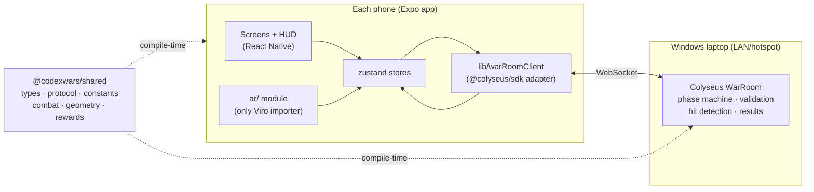

# CodexWars — Build Specification

**Version:** 1.3
**Companion to:** `PRD.md` v2.3 (product requirements; decision log in §2 there)
**Scope:** M0 (cross-platform colocation spike) through M2 (hardened P1). Product work is sketched only.
**Last updated:** 2026-07-14 — all package versions below verified against the npm registry on this date.

---

## 1. Guiding principles

Reliability is the top-priority requirement for this build. Every choice below follows from these rules:

1. **Pin everything.** Exact dependency versions, committed lockfile, and no range operators (`^` or `~`) on load-bearing packages. Upgrades happen deliberately, one package at a time, with a device test after each.
2. **Lock the checked-in baseline.** The current scaffold is Expo SDK 57 / React Native 0.86. It is accepted because Viro's declared peer range includes it, but it is not considered proven until the same native development build runs the M0 marker spike on Android and iOS.
3. **The server never knows AR exists.** It consumes 2D coordinates and directions. This makes the entire combat/multiplayer layer testable in plain Node with zero devices, and keeps the AR layer swappable (up to and including a Unity rewrite) without touching game logic.
4. **The AR layer sits behind one interface.** All Viro usage is confined to one module exposing a small contract (localization state, camera pose in arena coordinates). Nothing else imports Viro.
5. **No internet dependency at demo time.** Marker colocation needs no cloud service, so the whole game runs on a laptop server + phone hotspot LAN. The demo cannot be killed by venue WiFi or a cloud outage.
6. **Risk retires in order.** M0 proves marker colocation on both Android and iOS before any feature code exists. Each milestone has explicit exit criteria.
7. **Pure functions for everything with math in it.** Hit detection, coordinate conversion, validation, reward mapping — all side-effect-free, all unit-tested before device testing.
8. **Verify API shapes against current docs at implementation time** (use the docs-lookup tooling, e.g. ctx7/find-docs, for Viro and Colyseus specifics) — both libraries changed significantly in 2025–26 and training-data memory of their APIs is unreliable.

---

## 2. Pinned tech stack

Versions verified on npm, 2026-07-14:

| Package | Version | Role | Notes |
|---|---|---|---|
| `expo` | **57.0.4** | App framework, dev builds | Matches the checked-in scaffold. Keep the template-owned React/React Native pair (`react` 19.2.3, `react-native` 0.86.0); do not override either independently. |
| `react` / `react-native` / `@types/react` | **19.2.3 / 0.86.0 / 19.2.17** | Mobile runtime and JSX types | Expo SDK 57 compatibility set. Expo's expected `~19.2.4` range resolved to 19.2.17 and passed; exact 19.2.4 and the pulled 19.2.2 both failed React Native `View`/`Text` JSX typechecking in this workspace. |
| `@reactvision/react-viro` | **2.57.4** | AR rendering + image markers | Peer range: Expo ≥55 <58, RN ≥0.83 <0.87 — the checked-in SDK 57 / RN 0.86 pair fits. Requires a **development build** (`expo prebuild` / dev client); Expo Go cannot load it. |
| `colyseus` | **0.17.10** | Authoritative game server | 0.17 line: `defineServer()`, auto-reconnection, `onDrop`/`onReconnect` hooks. |
| `@colyseus/sdk` | **0.17.43** | Mobile client for Colyseus | Official 0.17 client SDK. Pin and verify this exact pair with the 0.17.10 server in the first networking spike. |
| `zustand` | **5.0.x, exact version selected at installation** | Client UI state | Small, no boilerplate; replace this placeholder with the exact installed version before M1. |
| `typescript` | **6.0.3 workspace-wide** | Everything | Strict mode on; one compiler version for mobile, server, and shared contracts. It passes after aligning `@types/react` with Expo SDK 57. |
| Node.js | **22.23.1** | Server + tooling runtime | Pin the same version in `.nvmrc`, `engines`, CI, and EAS profiles. |

**Explicitly not used:** ARCore Cloud Anchors or any hosted spatial service (PRD D1), ReactVision's managed anchor platform (new/unproven — optional experiment later, never load-bearing), Expo Go (incompatible with native AR modules).

---

## 3. Repository layout

npm workspaces monorepo — one language, one lockfile, shared types enforced by the compiler:

```
CodexWars/
├── package.json              # workspaces root; scripts fan out to packages
├── package-lock.json         # single lockfile, committed
├── .nvmrc                    # 22
├── PRD.md / BUILD_SPEC.md
├── packages/
│   └── shared/               # @codexwars/shared — zero runtime deps
│       ├── src/
│       │   ├── protocol.ts   # message names + payload types (client↔server)
│       │   ├── types.ts      # PlayerState, ArenaConfig, RoomPhase, ...
│       │   ├── constants.ts  # ALL gameplay tunables (weapons, arena, timers)
│       │   ├── combat.ts     # pure: resolveAttack, applyDamage, checkWinner
│       │   ├── geometry.ts   # pure: vec2 math, ray-circle, boundary/spacing
│       │   └── rewards.ts    # pure: quiz score → reward mapping
│       └── test/             # vitest — runs in CI with no devices
├── apps/
│   ├── server/               # @codexwars/server — Colyseus app
│   │   ├── src/
│   │   │   ├── index.ts      # defineServer / transport setup
│   │   │   ├── WarRoom.ts    # room class: lifecycle, phase machine
│   │   │   ├── schema/       # Colyseus state schema (mirrors shared types)
│   │   │   ├── roomId.ts     # unique 4-digit Colyseus roomId allocation/expiry
│   │   │   └── quiz.ts       # demo quiz data + scoring
│   │   └── test/             # @colyseus/testing integration tests
│   └── mobile/               # @codexwars/mobile — Expo app
│       ├── app.json          # expo config incl. Viro plugin
│       ├── src/
│       │   ├── features/     # lobby, quiz, positioning, battle slices
│       │   ├── screens/      # thin navigation targets (see §9.2)
│       │   ├── ar/           # THE ONLY place Viro is imported (see §9.3)
│       │   │   ├── ArenaSession.tsx     # Viro scene: marker, default GLB, effects
│       │   │   ├── coordinates.ts       # pure: marker-space conversions
│       │   │   └── types.ts             # ArSessionState contract
│       │   ├── lib/
│       │   │   └── warRoomClient.ts # only @colyseus/sdk importer: create/join/reconnect/send/on
│       │   ├── store/        # zustand stores (session, battle)
│       │   └── components/   # HUD, crosshair, health bars, buttons
│       └── assets/
│           ├── marker/       # marker image + printable PDF (see §5.2)
│           └── characters/   # bundled default GLB, P1 cosmetics, effects, sounds
```

Root scripts: `npm run server` (ts-node/tsx dev server), `npm run mobile` (expo start --dev-client), `npm test` (vitest across workspaces), `npm run typecheck`.

---

## 4. Development environment (Windows + physical Android and iPhone)

One-time setup, in order:

1. **Node 22.23.1** (nvm-windows), `corepack` off, npm only — no yarn/pnpm mixing. `.nvmrc`, EAS, CI, and local development use the same patch version.
2. **JDK 17** + **Android Studio** (SDK Platform for API 35, platform-tools). Set `ANDROID_HOME`, add `platform-tools` to PATH.
3. **Physical ARCore-capable Android phone**, developer mode + USB debugging on. Verify with `adb devices`. (Emulators cannot do ARCore camera tracking — all AR work is on-device.)
4. **Physical ARKit-compatible iPhone**, a paid Apple Developer account, a registered test device, and App Store Connect/TestFlight access. Enable iOS Developer Mode where required. EAS Build can create signed iPhone development builds from Windows, but iOS device testing still needs the physical phone.
5. **Expo account** + `eas-cli`; configure `eas.json` with a development profile and managed signing credentials.
6. The checked-in `apps/mobile` scaffold is the SDK 57 baseline. Normalize all load-bearing package entries to exact versions, add Viro + its config plugin to `app.json`, then produce the Android dev build locally and the iOS development build through EAS. Prepare an internal TestFlight profile for the final rehearsal binary. **The environment setup exits only when the same commit installs and opens a Viro scene on both physical devices** — a successful Expo Go screen is not sufficient.

Local dev networking: server on the Windows machine, phone on the same LAN/hotspot; the app takes a server URL (settings screen or `.env`) — no hardcoded IPs.

Recurring gotchas to expect (documented here so they don't burn hours):
- Viro requires the dev-client build; if the app opens in Expo Go, the AR scene will crash — always launch via the installed dev build.
- After any change to `app.json` plugins or native deps: rebuild Android locally and queue a new signed iOS EAS development build; test both before merging.
- Windows Defender/Firewall will prompt for the Node server's LAN port — allow it, or phones can't connect.

---

## 5. M0 — Colocation spike (go/no-go gate)

**Question M0 answers:** is Viro image-marker colocation good enough to aim at people with? Nothing in M1 starts until this is answered.

### 5.1 What gets built
A throwaway-quality but honest test app, two screens:

1. **Marker scan screen** — `ViroARImageMarker` tracking the bundled marker; on acquisition, captures the marker's pose and shows "LOCALIZED".
2. **Shared-space test screen** — renders (a) a virtual pillar fixed at the marker origin, (b) a second pillar at a hardcoded offset, e.g. `(1.5m, 0)` in marker space, and (c) a live readout of the camera's marker-space position and heading (this is `coordinates.ts` getting written for real).

Run it on **one Android and one iPhone simultaneously**. No server is needed — both phones use the same hardcoded offsets; agreement is judged physically.

### 5.2 Marker asset
- A4 print, high-contrast, feature-dense, asymmetric (so orientation is unambiguous), non-glossy paper. Prepare **2–3 candidate designs** and A/B them — marker quality is a first-class variable, not an afterthought.
- Follow ARCore augmented-image guidance: score candidates with the `arcoreimg` quality tool (target score ≥75); avoid repetitive patterns and sparse designs.
- Physical size must be declared to Viro exactly (A4 = 0.297 m width) — scale errors corrupt all distances.

### 5.3 Measurements and thresholds

| Metric | How measured | Pass |
|---|---|---|
| Acquisition time | Stopwatch from camera-on to LOCALIZED, 10 trials/phone, indoor classroom-like lighting | median ≤10 s, p90 ≤20 s |
| Cross-device agreement | Both phones localized; do the two pillars appear in the same physical spots? Measure apparent offset with a tape measure on the floor | ≤0.30 m at 3 m from marker |
| Aim-relevant angular error | Phone A placed at a marked floor position; does its reported heading toward a marked target position match reality? | ≤8° (generous hit cones absorb this) |
| Drift over a battle | Localize, then hold position for 3 minutes of camera-on tracking; re-measure pillar offset | ≤0.30 m additional |
| Marker-loss behavior | Cover the marker after localization; rotate the phone through marked headings | On both platforms, a fresh inertial pose continues updating for ≥90 s; when tracking is deliberately forced to fail, stale-pose detection disables firing within 1 s |

### 5.4 Go / no-go
- **Go:** all thresholds pass on the Android and iPhone → proceed to M1 as specced.
- **Conditional go:** agreement or drift marginally out → widen hit cones (raise `HIT_RADIUS`/`RAY_RADIUS` in `constants.ts`), shorten battle to 60 s, add a "re-scan marker" button to the battle HUD, proceed.
- **No-go:** acquisition regularly fails or errors exceed ~2× thresholds → AR P0 is blocked. The team must explicitly approve a revised non-AR P0 before implementing it; that revised product needs its own state, protocol, UI, and acceptance criteria. It is not silently treated as M1.

**Deliverable:** `M0_RESULTS.md` with the numbers, the chosen marker, and the decision.

---

## 6. System architecture

> Deeper design — deployment view, runtime sequence diagrams, state machines, coordinate/data ownership, and invariants — lives in `ARCHITECTURE.md`. This section is the working summary.



Data-flow rules:
- The **ar/ module** publishes into the store: `localizationState`, and (while in battle) the camera's marker-space position + floor-projected forward direction at ~10 Hz. It reads from the store: opponent positions/HP to render. It never talks to the network directly.
- The **multiplayer adapter** (`lib/warRoomClient.ts`) owns Colyseus matchmaking, room connection, reconnection, and message (de)serialization. It is the only mobile file that imports `@colyseus/sdk` and never touches Viro types.
- **Attacks:** button press → read latest aim from store → `attack` message → server resolves → `attack_resolved` broadcast → store update → HUD + AR effects react.

---

## 7. Shared package — protocol, types, constants

### 7.1 Constants (single source of tunables)

```ts
// packages/shared/src/constants.ts
export const ARENA = {
  MIN_RADIUS_M: 3, MAX_RADIUS_M: 6, DEFAULT_RADIUS_M: 4,
  MIN_SPACING_M: 1.5, MARKER_EXCLUSION_RADIUS_M: 0.75,
  MAX_PARTICIPANTS: 12,
} as const;

export const BATTLE = {
  DURATION_MS: 60_000, HARD_CAP_MS: 90_000,   // PRD D4
  COUNTDOWN_MS: 5_000, START_HP: 100,
  DISCONNECT_ELIMINATION_MS: 20_000,
  HOST_RECONNECT_GRACE_MS: 60_000,
} as const;

export const WEAPONS = {
  bolt:     { rangeM: 8, rayRadiusM: 0.35, damage: 10, cooldownMs: 1_000, charges: null },
  fireball: { rangeM: 7, rayRadiusM: 0.55, damage: 20, cooldownMs: 2_000, charges: 1 },
} as const;

export const PLAYER_HIT_RADIUS_M = 0.45;      // deliberately generous; M0 may raise it

export const QUIZ = {
  TEMPLATE_ID: "programming-fundamentals-v1",
  BASIC_QUESTION_MS: 30_000,
  DIFFICULT_QUESTION_MS: 45_000,
  REVEAL_MS: 5_000,
} as const;

export const AIM = {
  MIN_HORIZONTAL_MAGNITUDE: 0.1, // reject nearly vertical camera-forward vectors
  POSE_STALE_MS: 1_000,          // never fire from a frozen transform
} as const;
```

### 7.2 Protocol (all messages typed in one file)

Room creation and joining are **connection lifecycle operations**, not in-room messages. The organizer uses the Colyseus create flow for room type `war`; `WarRoom.onCreate` allocates a unique four-digit `roomId`, which is the public code. Participants resolve that code with the SDK join-by-ID flow. `onCreate`/`onJoin` assign the server-owned organizer/participant roles before any command below is accepted.

| Direction | Message | Payload |
|---|---|---|
| Organizer→S | `set_combat_included` | `{ playerId, included }` — quiz-only players remain in the room but are excluded from battle readiness |
| Organizer→S | `configure_arena` | `{ radiusM }` |
| Organizer→S | `select_quiz_template` | `{ templateId: "programming-fundamentals-v1", sessionName?: string }` |
| Organizer→S | `start_quiz` | `{}` — freezes the participant cohort and starts the server clock |
| C→S | `quiz_answer` | `{ questionId, optionId }` — exactly one answer before the authoritative deadline |
| C→S | `localization_changed` | `{ state: "searching" \| "localized" \| "lost" }` |
| C→S | `lock_position` | `{ x, z }` (marker-relative metres) |
| C→S | `unlock_position` | `{}` |
| C→S | `ready_changed` | `{ ready }` |
| Organizer→S | `start_battle` | `{}` |
| C→S | `attack` | `{ roundId, commandId, weapon, dirX, dirZ, predictedTargetId? }` — resolved once at server receipt; predicted target is **diagnostics only**, never trusted |
| S→C | `attack_resolved` | `{ roundId, eventSequence, commandId, attackerId, targetId \| null, damage, targetShield, targetHp }` |
| S→C | `player_eliminated` | `{ roundId, eventSequence, playerId }` |
| S→C | `battle_completed` | `{ roundId, eventSequence, winnerId, standings }` |
| S→C | `error` | `{ code, message, details? }`; position errors include `{ correction: { x, z }, distanceM }` so the UI can provide directional guidance |

Continuous state (player list, combat inclusion, phases, HP, positions, `roundId`, `startsAt`, `serverNow`, and public quiz state) flows through Colyseus **state sync**, not messages; messages are for discrete commands/events only. Clients calculate a server-time offset from the latest `serverNow` before rendering the countdown and quiz timers. Authoritative events carry a monotonically increasing per-round `eventSequence`; clients ignore an older round or a sequence already applied. This keeps LAN traffic tiny (PRD §9 reliability).

### 7.3 Core types
The organizer is a separate non-combat room member in P0. `PlayerState` represents participants only and includes `combatIncluded: boolean` (default true); quiz-only players still count toward `MAX_PARTICIPANTS` but are excluded from positioning and start gating. `RoomState` keeps phases `lobby → quiz → localization → positioning → countdown → battle → results`, and includes `roundId`, `eventSequence`, and `serverNow` for ordering/time alignment. `QuizState` includes `templateId`, `status`, `questionIndex`, a public current-question projection, `questionEndsAt`, and `revealEndsAt`; answer keys stay server-private until the reveal. `ArenaState` is `{ radiusM, status }` — no `cloudAnchorId`; the marker needs no server-side identity.

---

## 8. Server design (`apps/server`)

### 8.1 Room lifecycle
- One Colyseus room class `WarRoom` per battle session. `WarRoom.onCreate` allocates a unique four-digit custom `roomId` through Colyseus Presence; the public room code and transport room ID are the same identifier, so no pass-through code→room registry exists. Release the ID in `onDispose` and expire the room after two hours of inactivity.
- The creating connection becomes the server-owned, non-combat organizer. Organizer commands check that role on every call. If the organizer drops before countdown, the phase remains unchanged and organizer-only commands are unavailable for `HOST_RECONNECT_GRACE_MS`; expiry closes the room. Once countdown/battle starts, server timers and combat continue while organizer controls remain unavailable until reconnection.
- **Reconnection:** use Colyseus 0.17 `onDrop`/`onReconnect` — a dropped participant keeps their `PlayerState` for `DISCONNECT_ELIMINATION_MS` during battle (then auto-eliminated) and indefinitely pre-battle (organizer can remove).

### 8.2 Phase machine
Same machine as v1 (§18 of the draft). Every message handler follows: **phase gate → role/authority check → payload validation → gameplay invariant validation → state mutation → sync/broadcast**. For example, `lock_position` is only legal in `positioning`, and `attack` only in `battle` after `startsAt`. Illegal commands get typed `error` responses, never crashes.

**Start invariant** (server-enforced): every combat-included participant is `connected && localized && quizCompleted && position != null && ready`. Quiz-only participants never block the start. Countdown emits `startsAt = now + COUNTDOWN_MS` plus `serverNow`; clients render from their calculated server-time offset.

### 8.3 Combat resolution
The ray-vs-circle nearest-target algorithm and shield-before-HP damage order from the v1 draft (§15) carry over **verbatim** — they live in `packages/shared/src/combat.ts` as pure functions; `WarRoom` just calls them. Server-side validation before resolution: current `roundId`, unseen per-client `commandId`, attacker alive, phase is battle, `now ≥ startsAt`, cooldown elapsed (`nextAttackAt`), charges available, direction vector normalizable. P0 resolves attacks at server receipt; it has no client-clock lag compensation.

Match end: last-alive, or timer (server `setTimeout` anchored to `startsAt + DURATION_MS`) → highest HP → quiz score tiebreak. Results broadcast once. Organizer reset retains connected identities/nicknames/roles only, increments `roundId`, and clears quiz state/rewards, localization, positions, readiness, combat state, command deduplication, and per-round `eventSequence`.

### 8.4 What the server never does
No AR concepts, no camera data, no trust in client-computed hits, no persistence (in-memory only through M2).

---

## 9. Mobile app design (`apps/mobile`)

### 9.1 State: two zustand stores
- `sessionStore` — connection state, room snapshot mirror (players, phase, my server-assigned role), driven by `warRoomClient` state-sync listeners.
- `battleStore` — high-frequency local data: my live aim direction, predicted target, effect queue. Kept separate so 10 Hz aim updates don't re-render lobby UI.

### 9.2 Screens (React Navigation, ~10)
Home → Create/Join → Lobby (organizer variant selects and starts the fixed quiz, then shows minimap + phase controls) → Quiz → shield reward summary → Marker scan (guided) → Position lock → Battle (AR view + HUD) → Results. P0 renders one bundled default GLB avatar. Eliminated players stay on Battle behind a non-interactive eliminated overlay with live standings; free spectator navigation is P1. Screens are deliberately thin — logic lives in stores/shared.

### 9.3 The AR contract (only Viro importer)

```ts
// apps/mobile/src/ar/types.ts — everything outside ar/ codes against this
export type ArSessionState =
  | { status: "initializing" }
  | { status: "searching" }                       // looking for marker
  | { status: "localized"; sinceTs: number }
  | { status: "degraded"; sinceTs: number }        // fresh inertial pose; warn
  | { status: "tracking_lost"; lastPoseTs: number }; // no fresh pose; re-scan

export interface ArPose {
  position: { x: number; z: number };              // marker-space, metres
  aimDir: { x: number; z: number };                // forward projected to floor, normalized
  observedAt: number;
  quality: "tracked" | "inertial";
}
```

`ArenaSession.tsx` (Viro scene) responsibilities: track the marker → capture `T_marker` → convert camera pose each frame via `coordinates.ts` → publish timestamped `ArPose` to `battleStore` at 10 Hz → render opponents (bundled GLB + name + HP bar at each opponent's marker-space position), boundary ring, and pooled attack/hit effects. The aim calculation projects camera forward onto X/Z before sending; avatar height, mesh, and bones never affect a hit. Marker visibility and pose usability are distinct: a fresh inertial pose may continue, but the HUD disables firing when `now - observedAt > AIM.POSE_STALE_MS` or no normalized aim exists.

`coordinates.ts` is pure math, ported from v1 §14 with the marker as origin:
- **Lock position:** `p_camera_marker = inverse(T_marker) × p_camera_local` → store `(x, z)`.
- **Aim:** rotate camera forward into marker space, project to floor, normalize.
- **Render opponent:** `T_marker × [opp.x, AVATAR_HEIGHT_M, opp.z]`.
Unit-tested against hand-computed fixtures (identity, translated, rotated marker poses) before ever running on a device.

### 9.4 Battle HUD
Crosshair (center) with locked/unlocked states + target name/HP (never color-only — shape + label, PRD accessibility); fire buttons with radial cooldown; my HP/shield bar; timer; kill feed. High-contrast scrimmed panels over the camera. Sound + haptics (`expo-haptics`) on fire/hit/eliminated.

### 9.5 Camera/thermal discipline (PRD D4)
The AR session mounts only on the Marker-scan, Position-lock, and Battle screens and fully unmounts elsewhere. Target: ≤3 min camera-on per session.

---

## 10. Testing strategy

| Layer | Tool | What | Devices needed |
|---|---|---|---|
| Unit | vitest in `shared/` | geometry, combat (including aligned targets, boundary, spacing, shield order, and quiz-score tiebreaks), rewards, coordinate fixtures | none |
| Integration | `@colyseus/testing` in `server/` | matchmaking create/join-by-ID; organizer authorization; full-room/dup-names; quiz-only participant capacity; structured position errors; shield rewards; start invariant; command deduplication/event ordering; elimination→winner; reconnect-reattach; disconnect-timeout elimination; organizer-drop policy | none |
| Device — AR | manual protocol | M0 metrics re-run per marker/OS change on Android and iOS | one Android + one iPhone |
| Device — E2E | scripted manual runs | M1 demo twice on 3–4 mixed-platform devices; fresh-inertial vs stale pose; organizer/participant reconnect; server restart produces explicit session-ended UX | at least one Android + one iPhone |

CI (GitHub Actions): typecheck + unit + integration on every push. Device tests are checklists in the repo (`docs/device-test.md`), run before each milestone exit.

---

## 11. Demo/ops configuration

- **Demo topology:** Colyseus on the Windows laptop; laptop + all phones on one phone-hotspot (or the laptop's own hotspot). Zero internet dependency (§1.5). Firewall rule pre-added; server URL entered once per phone and persisted.
- **Config:** `.env` on the server (port), in-app server-URL field on mobile (persisted with `AsyncStorage`).
- **Post-M2 hosting:** a single VPS/PaaS pilot also needs TLS/WSS termination, WebSocket-aware ingress, health checks, process supervision, logs/metrics, abuse throttles, and client/server compatibility policy. Horizontal scale additionally needs shared Colyseus Presence/Driver (typically Redis), room placement, and durable product data separated from live room state. M3 begins with an explicit hosted architecture review; it is not a URL-only change.
- **Demo kit checklist:** 2 printed markers (primary + spare), tape, charged phones + power bank, laptop, pre-tested hotspot, rehearsed 5-minute script, and a recorded backup video of a successful run.

---

## 12. Build order

Strict order within milestones; nothing starts before its predecessor's exit criteria.

### M0 — Colocation spike *(exit: `M0_RESULTS.md` with go/conditional/no-go)*
1. Environment setup through first green Android and iOS on-device builds (§4).
2. Marker candidates + `arcoreimg` scoring.
3. Spike app (§5.1), Android+iPhone measurement protocol, decision.

### M1 — Vertical slice *(exit: PRD demo criteria on 3–4 devices including Android and iOS, twice in a row; the iOS rehearsal binary is in TestFlight)*
1. Workspace scaffolding; `shared/` types + constants + protocol; vitest wiring.
2. `geometry.ts` + `combat.ts` + `rewards.ts` with full unit tests. *(No devices needed — pure TDD.)*
3. Server: custom four-digit `roomId`, matchmaking create/join, `WarRoom` lifecycle + role authorization + phase machine + validation; integration tests green.
4. Mobile `warRoomClient` adapter + stores + non-AR screens (Home→Lobby→Quiz→Shield rewards); testable against the real server with **zero AR** — one Android and one iPhone in a lobby answering quizzes is the first end-to-end checkpoint.
5. `coordinates.ts` (with fixtures) + `ArenaSession` marker localization + position lock flow; organizer minimap.
6. Battle: aim publishing, attack round-trip, HUD, effects, elimination, results.
7. Multi-device testing, tuning (hit radii, cooldowns), demo rehearsal ×2.

### M2 — Hardening *(exit: a stranger runs a session from a one-page guide)*
Fireball + charges; three selectable bundled GLB cosmetics + palettes; spectator mode; **minimap fallback mode** with its own mode, assignment, and readiness protocol; tracking-loss pause + re-scan; organizer remove/reset; reconnection polish; the one-page organizer guide.

---

## 13. Definition of done (applies to every milestone)
- Typecheck + all unit/integration tests green.
- Device checklist for the milestone passed and dated in the repo.
- P0 exits only after the mixed Android+iOS device checklist has passed twice.
- No unpinned load-bearing dependency changed; lockfile diff reviewed.
- Tunables still live only in `constants.ts`; Viro imports still confined to `ar/`.
- `PRD.md` decision log updated if any settled decision changed.
