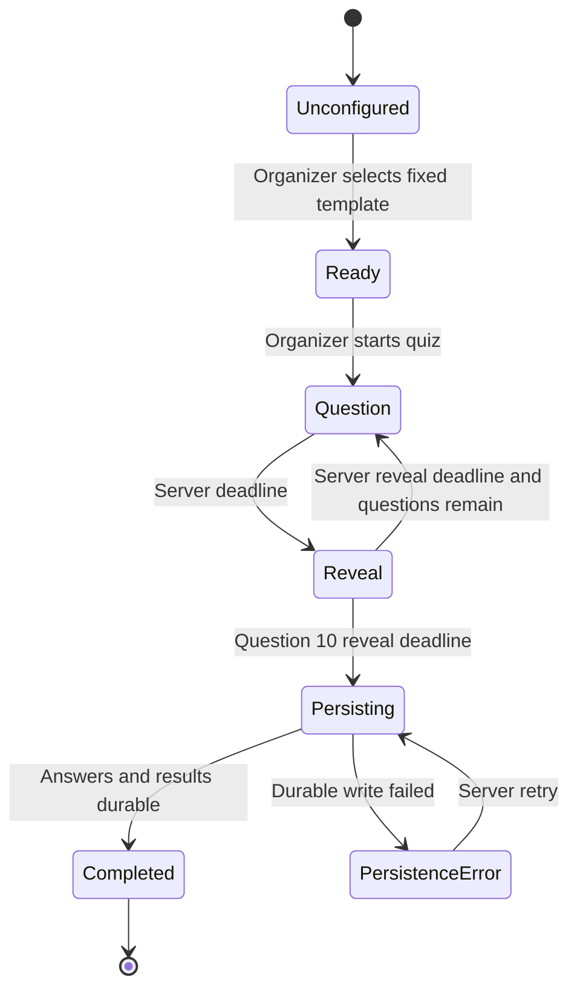
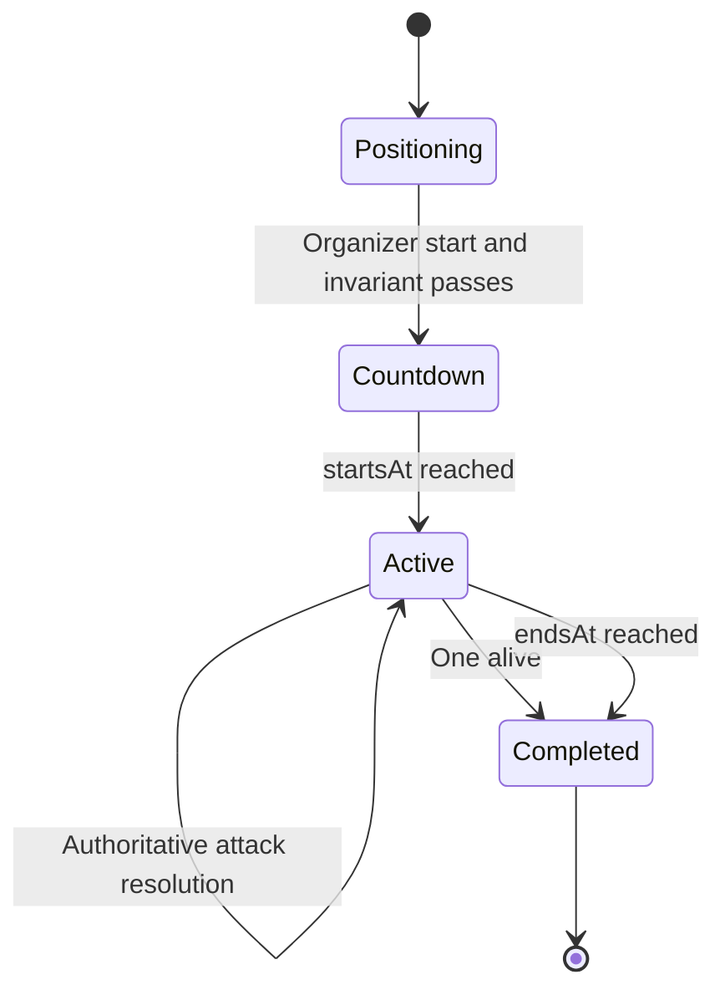
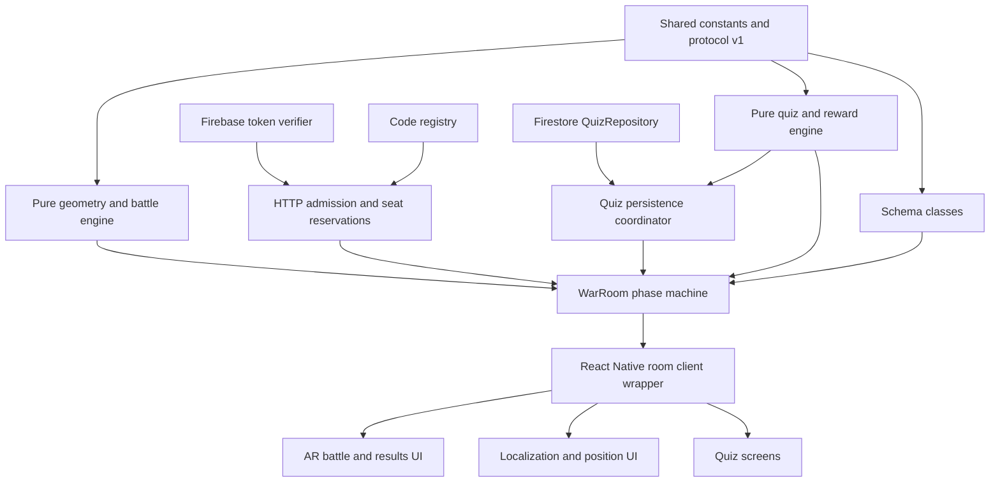

# CodexWars P0 — API and Realtime Collaboration Specification

**Status:** Authoritative implementation plan for P0

**Version:** 1.0

**Date:** 2026-07-14

**Applies to:** Android, iOS, Node.js server, Colyseus room protocol, and Firestore quiz persistence

## 1. Purpose and source alignment

This document defines every external server interface required for the P0 flow:

1. Organizer creates a War Room and configures the fixed ten-question quiz.
2. Participants join by four-digit code.
3. Organizer starts the quiz.
4. Participants receive questions, submit one answer, see the reveal, and receive results.
5. The server derives Battle Stats from the quiz result independently of Character.
6. Combat participants localize, lock positions, and become ready.
7. Organizer starts the synchronized battle.
8. Participants render synchronized positions and Battle Stats, issue two-dimensional attacks, and receive authoritative resolutions.
9. All clients receive the same winner and final standings.

The active sources are `PRD.md`, `BUILD_SPEC.md`, `ARCHITECTURE.md`, `docs/IMPLEMENTATION_PLAN.md`, and `docs/AR_IMPLEMENTATION_SPEC.md`. The retired v1 PRD/TDD is historical input only. Where its cloud-anchor or batch-quiz behavior differs, the active marker-based, sequential-quiz design wins.

This specification also corrects one protocol issue in the earlier build plan: `create_room` and `join_room` cannot be in-room messages because a client has no room connection yet. Admission uses HTTP to obtain a Colyseus 0.17 seat reservation; the React Native client then calls `consumeSeatReservation()`. Live commands begin only after the WebSocket room connection exists.

## 2. Locked P0 decisions

| Concern | P0 decision |
|---|---|
| Quiz creation | “Create quiz” means create a Quiz Run from the published `programming-fundamentals-v1` template. Arbitrary quiz authoring is P2. |
| Question count | Exactly 10: seven 30-second questions and three 45-second questions, each followed by a 5-second Reveal. |
| Character | Cosmetic-only. P0 guarantees one bundled fallback; the server may expose additional approved bundled cosmetics without changing gameplay. Character and color never affect Battle Stats or hit detection. |
| Quiz reward | Correct-answer count maps only to starting shield: 0–2 → 0, 3–4 → 10, 5–6 → 20, 7–8 → 30, 9–10 → 40. |
| Base combat | Every Combat Participant starts with 100 HP and the same basic bolt configuration. |
| Position | A single marker-relative `(x,z)` Locked Position. No live movement stream exists during battle. |
| Aim and hitbox | Only normalized `(dirX,dirZ)` is sent on fire. Camera pitch, GLB mesh, model height, bones, and 3D colliders are irrelevant. |
| Durable data | Firestore stores Quiz Templates, Answer Submissions, and Quiz Results. It does not store live room state, positions, attacks, HP, or Battle Results. |
| Realtime authority | One Colyseus 0.17 `WarRoom` owns clocks, phases, scoring, rewards, positions, combat, and winner selection. |
| Client SDK | React Native uses the locked `@colyseus/sdk` 0.17 client paired with the Colyseus 0.17 server. |

## 3. Transport architecture

### 3.1 Interface split

| Interface | Transport | Responsibilities |
|---|---|---|
| Operational HTTP | HTTP/JSON | Liveness, readiness, public catalog/rules metadata |
| Admission HTTP | HTTPS/JSON | Verify Firebase identity, create a War Room, resolve a room code, reserve a seat |
| War Room commands | Colyseus messages over WebSocket | Discrete organizer/participant intent |
| War Room state | Colyseus Schema patches | Current roster, phase, quiz projection, positions, Battle Stats, and results |
| War Room events | Colyseus messages over WebSocket | One-time acknowledgements and presentation effects |
| Quiz persistence | Firebase Admin to Firestore | Trusted template reads and server-only submission/result writes |
| Own result read | Firebase client to Firestore | Optional direct read of only the authenticated participant's completed Quiz Result |

No polling endpoint is used for questions, positions, HP, timers, or standings. No client writes gameplay data directly to Firestore.

### 3.2 Realtime framework

- Server: Node.js 22 + TypeScript + `colyseus` 0.17.x with `@colyseus/schema` 4.x.
- Mobile: `@colyseus/sdk` 0.17.x.
- One `WarRoom` instance contains one complete P0 run.
- Colyseus patch interval: 100 ms (10 Hz). Only changed fields are patched.
- `serverNow` changes at 1 Hz and is also included in time-critical events. Clients derive a clock offset; they never decide deadlines.
- Continuous aim remains client-local. A network message is sent only when the fire button is pressed.
- Automatic reconnection uses `onDrop`, `allowReconnection`, `onReconnect`, and `onLeave`.
- Battle reconnection window: 20 seconds. Pre-battle participants remain in room state until the organizer removes them or the room expires.
- The client wrapper disables sends while disconnected and configures zero queued gameplay messages. Attacks are never replayed after reconnect.

Official Colyseus documentation confirms server-side seat reservation and frontend `consumeSeatReservation`, Schema state synchronization, typed room messages, and the 0.17 automatic reconnection lifecycle. See [Match-maker API](https://docs.colyseus.io/matchmaker), [client SDK](https://docs.colyseus.io/client), [Schema](https://docs.colyseus.io/state/schema), [reconnection](https://docs.colyseus.io/room/reconnection), and [0.17 migration](https://docs.colyseus.io/migrating/0.17).

## 4. Authentication, identity, and authorization

### 4.1 Identity

1. The mobile app signs in with Firebase Anonymous Authentication.
2. It obtains a Firebase ID token.
3. Admission requests send `Authorization: Bearer <firebase-id-token>` over HTTPS.
4. The server verifies the token with Firebase Admin and uses the decoded `uid` as the private identity key.
5. The server passes trusted `{ uid, role, playerId }` auth data into the Colyseus seat reservation.
6. `uid` and raw tokens are never synchronized in room state.

Firebase documents this custom-backend pattern in [Verify ID Tokens](https://firebase.google.com/docs/auth/admin/verify-id-tokens).

### 4.2 Role assignment

- `POST /v1/rooms` creates the Organizer seat. A client cannot request the Organizer role through a join payload.
- `POST /v1/rooms/{code}/reservations` creates a Participant seat.
- The Organizer role is bound to the verified UID for the lifetime of the War Room.
- A reconnect restores the existing player record; it does not create another participant.
- Organizer-only commands are rejected for participants with `ROLE_FORBIDDEN`.

### 4.3 Public and private identifiers

| Identifier | Visibility | Purpose |
|---|---|---|
| Firebase `uid` | Server and own Firestore security rule only | Authentication and durable Quiz Result ownership |
| `playerId` | All room clients | Stable public participant reference |
| Colyseus `sessionId` | Server/client transport internals | Connection and reconnection |
| `roomId` | Admission response/SDK | Colyseus routing; not displayed to users |
| `roomCode` | Participants in the physical session | Four-digit human join code |
| `quizRunId` | Room state and result document path | Correlates the live Quiz Run with Firestore |

## 5. Common conventions

### 5.1 Versioning

- HTTP resources use `/v1`.
- Room state includes `protocolVersion = 1`.
- Every mobile build declares the supported protocol version during admission.
- Mismatch returns `CLIENT_VERSION_UNSUPPORTED` before reserving a seat.

### 5.2 Request IDs and idempotency

Every mutating room command contains:

```ts
type CommandMeta = {
  requestId: string; // UUID generated once per user action
};
```

The server retains a bounded per-player cache of processed request IDs until room disposal. A duplicate receives the original acknowledgement or is ignored without applying the mutation again.

Additional semantic idempotency keys:

- Answer Submission: `(quizRunId, uid, questionId)`.
- Character selection: latest accepted value before selection freezes.
- Lock/ready/localization commands: set-value semantics.
- Attack Request: `requestId`; a duplicate can never inflict damage twice.
- Battle completion: one `battleRevision` transition to completed; events emit once.

### 5.3 Time

- All timestamps are Unix epoch milliseconds from the server.
- The server receives an answer or attack at `receivedAt` and uses that time for validation.
- Client timestamps are diagnostics only.
- A question accepts submissions when `receivedAt < questionEndsAt`.
- Battle attacks accept when `startsAt <= receivedAt < endsAt`.
- The countdown, quiz, Reveal, cooldown, reconnection grace, and match timer are server timers.

### 5.4 Error shape

HTTP failures use `application/problem+json`:

```json
{
  "type": "https://codexwars.dev/problems/ROOM_NOT_FOUND",
  "title": "Room not found",
  "status": 404,
  "code": "ROOM_NOT_FOUND",
  "detail": "No active room matches that code.",
  "requestId": "server-correlation-id",
  "retryable": false
}
```

WebSocket command failures use:

```ts
type CommandError = {
  requestId?: string;
  code: ErrorCode;
  message: string;
  retryable: boolean;
  details?: Record<string, string | number | boolean | string[]>;
};
```

Messages never include stack traces, tokens, UID values, answer keys before Reveal, or raw Firestore errors.

## 6. HTTP API

### 6.1 `GET /health`

Process liveness only. It must not call Firestore.

Response `200`:

```json
{
  "status": "ok",
  "service": "codexwars-server",
  "version": "0.1.0",
  "protocolVersion": 1
}
```

### 6.2 `GET /ready`

Deployment readiness. It checks server initialization, Colyseus matchmaker availability, and a cached Firestore connectivity probe.

- `200`: ready for new War Rooms.
- `503`: do not admit new rooms; existing in-memory battles continue.

```json
{
  "status": "ready",
  "checks": {
    "colyseus": "ok",
    "firestore": "ok"
  }
}
```

### 6.3 `GET /v1/catalog/characters`

Returns the server allow-list and presentation metadata. It never returns Battle Stats. P0 acceptance needs only the fallback entry, while the current bundled catalog can enable the approved `knight`, `ninja`, and `wizard` cosmetics and their pre-baked color variants without changing the protocol.

P0 response `200`:

```json
{
  "catalogVersion": 1,
  "fallbackCharacterId": "knight",
  "fallbackColorId": "gold",
  "characters": [
    {
      "id": "knight",
      "displayName": "Knight",
      "colorIds": ["gold", "coral", "aqua", "violet"],
      "assetKeyPrefix": "knight",
      "availability": "enabled"
    },
    {
      "id": "ninja",
      "displayName": "Ninja",
      "colorIds": ["gold", "coral", "aqua", "violet"],
      "assetKeyPrefix": "ninja",
      "availability": "enabled"
    },
    {
      "id": "wizard",
      "displayName": "Wizard",
      "colorIds": ["gold", "coral", "aqua", "violet"],
      "assetKeyPrefix": "wizard",
      "availability": "enabled"
    }
  ]
}
```

The client maps `assetKey` to a bundled, versioned GLB manifest. The server does not accept an asset URL, transform, scale, collider, or animation from a client.

### 6.4 `GET /v1/rules/battle`

Returns public Battle Stats and reward rules for UI explanation. This resource contains no answer key.

Response `200`:

```json
{
  "rulesVersion": 1,
  "baseStats": {
    "maxHp": 100,
    "weaponId": "bolt",
    "damage": 10,
    "rangeM": 8,
    "rayRadiusM": 0.35,
    "cooldownMs": 1000,
    "charges": null
  },
  "shieldRewards": [
    { "minCorrect": 0, "maxCorrect": 2, "startingShield": 0 },
    { "minCorrect": 3, "maxCorrect": 4, "startingShield": 10 },
    { "minCorrect": 5, "maxCorrect": 6, "startingShield": 20 },
    { "minCorrect": 7, "maxCorrect": 8, "startingShield": 30 },
    { "minCorrect": 9, "maxCorrect": 10, "startingShield": 40 }
  ]
}
```

This endpoint answers “what stats are available after N correct answers.” The response is player/loadout data, never Character data.

### 6.5 `POST /v1/rooms`

Creates a War Room and reserves its Organizer seat.

Headers:

```http
Authorization: Bearer <firebase-id-token>
Idempotency-Key: <uuid>
Content-Type: application/json
```

Request:

```json
{
  "organizerName": "Ada",
  "clientProtocolVersion": 1
}
```

Validation:

- Valid Firebase ID token.
- Name trimmed, 1–24 visible characters, control characters removed.
- Idempotency key required.
- One active Organizer seat per UID/idempotency key.

Server behavior:

1. Allocate a collision-free four-digit code.
2. Create `war_room` through the Colyseus matchmaker.
3. Reserve a seat with trusted Organizer auth data.
4. Return the Colyseus 0.17 seat reservation object unchanged under `seatReservation`.

Response `201`:

```json
{
  "roomCode": "4821",
  "seatReservation": {
    "name": "war_room",
    "roomId": "colyseus-room-id",
    "processId": "process-id",
    "sessionId": "reserved-session-id",
    "publicAddress": "192.168.1.10:4000"
  },
  "reservationExpiresAt": 1784029200000
}
```

The mobile client immediately calls `client.consumeSeatReservation(seatReservation)`.

### 6.6 `POST /v1/rooms/{code}/reservations`

Resolves the human code and reserves one Participant seat.

Headers are identical to room creation and require a fresh idempotency key.

Request:

```json
{
  "displayName": "Grace",
  "clientProtocolVersion": 1
}
```

Server validation:

- Code is exactly four digits and maps to an active, joinable War Room.
- Room phase is `lobby`.
- Total participant capacity is below 12.
- The UID is not already joined, except when the server returns the existing reconnect path.
- Duplicate display names receive a deterministic numeric suffix.
- `combatIncluded` defaults to `true`; only the Organizer can change it.

Response `200`:

```json
{
  "roomCode": "4821",
  "displayName": "Grace (2)",
  "seatReservation": {
    "name": "war_room",
    "roomId": "colyseus-room-id",
    "processId": "process-id",
    "sessionId": "reserved-session-id",
    "publicAddress": "192.168.1.10:4000"
  },
  "reservationExpiresAt": 1784029200000
}
```

### 6.7 HTTP endpoints deliberately absent

| Requested capability | Correct P0 interface |
|---|---|
| Get questions | `QuizPublicState.currentQuestion` Schema state |
| Check answer correctness | `quiz_answer` acknowledgement, then Reveal state/event at deadline |
| Get live quiz scores | `PlayerState.quiz` after server scoring |
| Get all participant positions | `RoomState.players` MapSchema patches |
| Get HP/shield/cooldowns | `PlayerState.battleStats` patches |
| Start quiz or battle | Organizer room command |
| Fire at opponent | Participant room command |
| Get final battle results | `BattleState.standings` plus `battle_completed` event |

Adding REST polling for these would create a second source of truth and is prohibited.

## 7. Colyseus synchronized state

The following are logical TypeScript contracts. Their implementation uses Schema classes, `MapSchema` for players, and Schema-compatible primitives/collections.

### 7.1 Room state

```ts
type RoomPhase =
  | "lobby"
  | "quiz"
  | "localization"
  | "positioning"
  | "countdown"
  | "battle"
  | "results";

type WarRoomState = {
  protocolVersion: 1;
  roomCode: string;
  phase: RoomPhase;
  organizerPlayerId: string;
  serverNow: number;
  players: Map<string, PlayerPublicState>;
  arena: ArenaState;
  quiz: QuizPublicState;
  battle: BattleState;
};
```

### 7.2 Player state

```ts
type PlayerPublicState = {
  playerId: string;
  displayName: string;
  role: "organizer" | "participant";
  connected: boolean;
  combatIncluded: boolean;
  characterId: string;          // validated catalog ID
  characterColorId: string;     // validated variant ID for that Character

  quizCompleted: boolean;
  correctAnswers: number;       // finalized value; 0 during active quiz
  hasAnsweredCurrent: boolean;  // no option ID is synchronized

  localization: "not_started" | "searching" | "localized" | "lost";
  positionLocked: boolean;
  positionX: number;
  positionZ: number;
  ready: boolean;

  maxHp: number;
  hp: number;
  shield: number;
  weaponId: "bolt";
  charges: number;              // -1 means unlimited in Schema representation
  nextAttackAt: number;
  eliminated: boolean;
  disconnectedAt: number;
};
```

The Organizer has no combat position or Battle Stats. UID, selected answer, correct-answer history, raw auth token, and Firestore paths are server-private.

### 7.3 Quiz state

```ts
type QuizStatus =
  | "unconfigured"
  | "ready"
  | "question"
  | "reveal"
  | "persisting"
  | "completed"
  | "persistence_error";

type PublicQuizQuestion = {
  id: string;
  order: number;
  prompt: string;
  options: Array<{ id: string; label: string }>;
  difficulty: "basic" | "intermediate" | "difficult";
  durationMs: number;
};

type QuizPublicState = {
  quizRunId: string;
  templateId: "programming-fundamentals-v1";
  templateVersion: number;
  title: string;
  status: QuizStatus;
  questionIndex: number;        // -1 before first question
  questionCount: 10;
  currentQuestion?: PublicQuizQuestion;
  questionEndsAt: number;
  revealEndsAt: number;
  revealedCorrectOptionId: string; // empty until Reveal
  revealedExplanation: string;     // empty until Reveal
  submittedCount: number;
  eligibleCount: number;
  persistencePending: number;
};
```

The answer key never appears in state while status is `question`. At transition to `reveal`, the server sets the revealed fields, scores accepted answers, and updates only non-secret public status.

### 7.4 Arena and battle state

```ts
type ArenaState = {
  radiusM: number;
  minimumSpacingM: number;
  configured: boolean;
};

type Standing = {
  rank: number;
  playerId: string;
  displayName: string;
  hp: number;
  shield: number;
  correctAnswers: number;
  eliminated: boolean;
};

type BattleState = {
  status: "not_started" | "countdown" | "active" | "completed";
  startsAt: number;
  endsAt: number;
  revision: number;
  winnerId: string;
  completionReason: "" | "last_alive" | "timer";
  standings: Standing[];
};
```

All participant positions are obtained by iterating `players` and selecting records where `combatIncluded && positionLocked`. Position patches are sparse because players remain stationary. There is no `get_all_positions` command.

## 8. Organizer commands

Every handler executes: authenticate sender → authorize role → validate phase → validate payload → validate domain invariants → mutate authoritative state → schedule persistence → acknowledge/broadcast.

### 8.1 `set_combat_included`

```ts
type SetCombatIncluded = CommandMeta & {
  playerId: string;
  included: boolean;
};
```

- Allowed only in `lobby` before quiz cohort freeze.
- Target must be a Participant.
- When set false, clear localization, position, ready, and Battle Stats.
- A Quiz-only Participant still answers all questions and receives a Quiz Result.

### 8.2 `configure_arena`

```ts
type ConfigureArena = CommandMeta & { radiusM: number };
```

- Allowed in `lobby`, `quiz`, or `localization`; frozen once any position is locked.
- Radius range: 3–6 metres.
- Minimum spacing remains server constant 1.2 metres in P0.

### 8.3 `select_quiz_template`

```ts
type SelectQuizTemplate = CommandMeta & {
  templateId: "programming-fundamentals-v1";
  sessionName?: string;
};
```

This is the P0 “organizer create quiz” operation.

Server behavior:

1. Require `lobby` phase.
2. Load the published template and full answer key from Firestore through `QuizRepository`.
3. Validate template version, exactly ten ordered questions, option IDs, durations, and answer keys.
4. Create a unique `quizRunId` in memory and Firestore.
5. Set quiz status `ready` without exposing any question answer key.

If Firestore is unavailable or the template is invalid, the command fails and quiz start remains blocked.

### 8.4 `start_quiz`

```ts
type StartQuiz = CommandMeta;
```

Server behavior:

1. Require `lobby`, quiz status `ready`, Organizer connected, and at least one Participant.
2. Freeze the participant cohort and combat-inclusion settings.
3. Set phase `quiz`.
4. Publish question 1 without its answer key.
5. Set `questionEndsAt = now + durationMs` and broadcast `quiz_question_started`.
6. Automatically transition through all ten Question/Reveal intervals; there is no Next command.

### 8.5 `start_battle`

```ts
type StartBattle = CommandMeta;
```

Allowed only in `positioning`. For every Combat Participant, the server requires:

```text
connected
AND quizCompleted
AND localization == localized
AND positionLocked
AND ready
AND not eliminated
```

On success:

1. Initialize HP, shield, bolt stats, and elimination state from server rules.
2. Set phase `countdown` and Battle status `countdown`.
3. Set `startsAt = now + 5_000` and `endsAt = startsAt + 60_000`.
4. Broadcast `battle_countdown_started` with server time.
5. At `startsAt`, transition exactly once to `battle`/`active`.

On failure, return `BATTLE_START_BLOCKED` to the Organizer with per-player reason codes, not raw private identifiers.

### 8.6 `reset_round`

```ts
type ResetRound = CommandMeta;
```

- Allowed only in `results`.
- Returns to `lobby`, retains connected participant identities/display names, and clears the previous Quiz Run, positions, readiness, Battle Stats, and Battle Result.
- A new `select_quiz_template` creates a new Quiz Run and new Firestore documents.

## 9. Participant commands

### 9.1 `quiz_answer`

```ts
type QuizAnswerCommand = CommandMeta & {
  questionId: string;
  optionId: string;
};
```

Acceptance rules:

- Sender is a frozen-cohort Participant.
- Room phase is `quiz`; quiz status is `question`.
- `questionId` equals the current question.
- `optionId` exists in the public option list.
- Server receipt time is strictly before `questionEndsAt`.
- No Answer Submission already exists for this UID/question.

On acceptance:

1. Record the answer and server receipt time in the private Quiz Engine state.
2. Set `hasAnsweredCurrent = true` and increment `submittedCount`.
3. Persist idempotently through `QuizRepository`.
4. Send `quiz_answer_accepted` only to the sender.

The acknowledgement does not reveal correctness. At deadline, the server scores every accepted submission, treats missing submissions as incorrect, publishes Reveal, and sends each Participant a private `quiz_answer_result`.

### 9.2 `select_character`

```ts
type SelectCharacter = CommandMeta & {
  characterId: string;
  colorId: string;
};
```

- P0 requires the bundled fallback and may enable other entries returned by the current catalog.
- Allowed before countdown.
- The Character ID and color ID pair must exist in the server allow-list.
- It changes only `characterId` and `characterColorId`; Battle Stats remain untouched.
- Asset URLs, transforms, scales, hitboxes, animations, HP, damage, or other stats are invalid fields.

### 9.3 `localization_changed`

```ts
type LocalizationChanged = CommandMeta & {
  state: "searching" | "localized" | "lost";
};
```

- Allowed for Combat Participants during `localization` and `positioning`.
- Before countdown, `lost` clears ready.
- During P0 battle, marker loss does not alter the server-held Locked Position and sends no pose stream; the client prompts re-scan locally.

### 9.4 `lock_position`

```ts
type LockPosition = CommandMeta & { x: number; z: number };
```

Validation:

- Phase `positioning`, Combat Participant, localized, finite numbers.
- Distance from arena origin is within configured radius.
- Distance from every other Locked Position is at least 1.2 m.
- Position remains stationary once countdown starts.

Rejection details may include `distanceOutsideM` or `requiredAdditionalSpacingM` for directional UI guidance. The server never accepts Y, camera transforms, latitude/longitude, or a GLB position.

### 9.5 `unlock_position`

```ts
type UnlockPosition = CommandMeta;
```

- Allowed only in `positioning`.
- Clears position and ready.

### 9.6 `ready_changed`

```ts
type ReadyChanged = CommandMeta & { ready: boolean };
```

Setting true requires quiz complete, localization `localized`, and a valid Locked Position. Setting false is allowed until countdown begins.

### 9.7 `attack`

```ts
type AttackCommand = CommandMeta & {
  weaponId: "bolt";
  dirX: number;
  dirZ: number;
  predictedTargetId?: string; // diagnostics only
};
```

Validation at server receipt:

- Phase `battle`, Battle status `active`, and current time inside battle interval.
- Sender is connected, combat-included, alive, positioned, and not in cooldown.
- Direction values are finite and horizontal magnitude is valid; normalize server-side within tolerance.
- Weapon matches the server-owned loadout and has available charges.
- `requestId` has not been processed.

Resolution:

1. Use the sender's Locked Position as ray origin.
2. Use normalized `(dirX,dirZ)` as ray direction.
3. Test eligible opponents as two-dimensional circles with server-owned radius.
4. Select the nearest valid ray-circle intersection within range.
5. Apply shield before HP.
6. Mark HP 0 as eliminated and prevent later attacks.
7. Increment `battle.revision`, patch state, and broadcast `attack_resolved`.
8. Check last-alive completion after the state mutation.

`predictedTargetId`, camera pitch, GLB mesh, model height, bones, animations, and visual projectile paths never influence resolution.

## 10. Server events

Events drive acknowledgements and one-time visual/audio effects. Schema state remains the recovery source of truth after a missed or duplicate event.

### 10.1 Generic events

```ts
type CommandAccepted = {
  requestId: string;
  command: string;
  serverNow: number;
};

type ServerError = CommandError;
```

### 10.2 Quiz events

```ts
type QuizQuestionStarted = {
  questionId: string;
  questionIndex: number;
  questionEndsAt: number;
  serverNow: number;
};

type QuizAnswerAccepted = {
  requestId: string;
  questionId: string;
  acceptedAt: number;
  persistence: "stored" | "pending";
};

type QuizQuestionRevealed = {
  questionId: string;
  correctOptionId: string;
  explanation: string;
  revealEndsAt: number;
};

type QuizAnswerResult = {
  questionId: string;
  selectedOptionId?: string;
  correct: boolean;
  runningCorrectAnswers: number;
};

type QuizCompleted = {
  quizRunId: string;
  correctAnswers: number;
  questionCount: 10;
  startingShield: number;
};
```

`quiz_answer_result` and `quiz_completed` are sent directly to the owning Participant. The Organizer observes completion and finalized totals through synchronized state.

### 10.3 Battle events

```ts
type BattleCountdownStarted = {
  startsAt: number;
  endsAt: number;
  serverNow: number;
};

type AttackResolved = {
  requestId: string;
  revision: number;
  attackerId: string;
  targetId: string | null;
  damage: number;
  targetShield: number | null;
  targetHp: number | null;
  serverNow: number;
};

type PlayerEliminated = {
  revision: number;
  playerId: string;
  eliminatedByPlayerId: string | null;
};

type BattleCompleted = {
  revision: number;
  winnerId: string;
  reason: "last_alive" | "timer";
  standings: Standing[];
};
```

Clients deduplicate effects by `revision`. HP and winner UI always reconcile to synchronized state, not event arrival order.

## 11. Quiz collaboration state machine



Realtime collaboration rules:

1. The server publishes a single public question projection.
2. Each Participant can submit once; other clients see only aggregate submission count and a boolean, never the option.
3. The server clock closes the question even if some participants are disconnected or silent.
4. Correctness is hidden until Reveal.
5. Missing answers score zero.
6. Reconnected clients recover question, timers, submission boolean, and phase from Schema state.
7. After question 10, the server derives shield, persists Quiz Results, marks completion, and advances to `localization` only after required writes are durable.
8. A Firestore failure never rewinds a scored answer. It sets `persistence_error`, retries with backoff, and blocks progression to localization while showing the Organizer a recoverable error.

## 12. Battle collaboration state machine



Battle synchronization rules:

1. Locked Positions and Battle Stats are Schema state.
2. Aim direction is local and sent only inside `attack`.
3. The server resolves at receipt time with no client-clock lag compensation in P0.
4. `attack_resolved` is immediate presentation data; the state patch is authoritative recovery data.
5. Eliminated clients remain connected, render standings, and cannot attack.
6. Timer completion ranks by remaining HP, then correct-answer count. Any remaining exact tie uses a deterministic stable fallback such as `playerId` ordering; this must be implemented and tested so winner selection never depends on map iteration order.
7. The Battle Result exists until reset or room expiry and is not written to Firestore.

## 13. Firestore data contract

### 13.1 Collections

```text
quizTemplates/{templateId}
  questions/{questionId}

quizSessions/{quizRunId}
  submissions/{uid}
  results/{uid}
```

The existing collection name `quizSessions` remains for compatibility, while domain documentation calls the record a Quiz Run.

### 13.2 Quiz Template

```ts
type StoredQuizTemplate = {
  version: number;
  title: string;
  questionCount: 10;
  status: "published";
  updatedAt: Timestamp;
};
```

Question documents contain prompt, ordered options, answer key, explanation, difficulty, and duration. Only Firebase Admin reads them during live play.

### 13.3 Quiz Run

```ts
type StoredQuizRun = {
  organizerUid: string;
  templateId: string;
  templateVersion: number;
  status: "active" | "completed";
  startedAt: Timestamp;
  completedAt?: Timestamp;
};
```

Do not persist room code, positions, character, combat data, or camera data.

### 13.4 Submission

```ts
type StoredSubmission = {
  answers: Array<{
    questionId: string;
    optionId: string;
    submittedAt: Timestamp;
  }>;
  score?: number;
  shieldReward?: number;
  updatedAt: Timestamp;
  scoredAt?: Timestamp;
};
```

The unique document per UID plus a transaction enforces one answer per question. Firestore transactions may retry, so transaction functions must have no external side effects. See [transactions and batched writes](https://firebase.google.com/docs/firestore/manage-data/transactions).

### 13.5 Quiz Result

```ts
type StoredQuizResult = {
  rank: number;
  score: number;
  questionCount: 10;
  shieldReward: number;
  completedAt: Timestamp;
};
```

P0 should remove `displayName` from the durable result even though the current repository type contains it. Display names remain in-memory room data; omitting them from Firestore better matches the PRD's data-minimization rule. The authenticated user already owns the result document by UID.

### 13.6 Result access

- The server uses Admin credentials and is the only writer.
- The mobile Firebase SDK may read only `quizSessions/{quizRunId}/results/{request.auth.uid}`.
- Participants cannot list results or read another UID.
- The Organizer sees live/final room Quiz Results through Schema state but has no post-expiry history in P0.
- Battle Results are never written to Firestore in P0.

## 14. Error catalogue

| Code | Interface | Meaning | Retryable |
|---|---|---|---|
| `AUTH_REQUIRED` | HTTP | Missing bearer token | No |
| `AUTH_TOKEN_INVALID` | HTTP | Token invalid/expired | Yes after refresh |
| `CLIENT_VERSION_UNSUPPORTED` | HTTP | Protocol mismatch | No; update app |
| `RATE_LIMITED` | Both | Admission/command rate exceeded | Yes |
| `ROOM_NOT_FOUND` | HTTP | Code has no active room | No |
| `ROOM_NOT_JOINABLE` | HTTP | Phase is no longer lobby | No |
| `ROOM_FULL` | HTTP | 12 Participants already admitted | No |
| `NICKNAME_INVALID` | HTTP | Name violates length/content rules | No |
| `ROLE_FORBIDDEN` | WS | Sender lacks required role | No |
| `PHASE_MISMATCH` | WS | Command illegal in current phase | Usually no |
| `TEMPLATE_NOT_FOUND` | WS | Fixed template absent | Yes after operator fix |
| `TEMPLATE_INVALID` | WS | Published template fails validation | No until fixed |
| `QUIZ_NOT_READY` | WS | Quiz start precondition failed | Yes |
| `QUIZ_ALREADY_STARTED` | WS | Cohort already frozen | No |
| `QUESTION_MISMATCH` | WS | Answer references another question | No |
| `ANSWER_OPTION_INVALID` | WS | Option not on current question | No |
| `ANSWER_DUPLICATE` | WS | Existing accepted answer | No |
| `ANSWER_LATE` | WS | Received at/after deadline | No |
| `PERSISTENCE_UNAVAILABLE` | Both | Firestore unavailable | Yes |
| `CHARACTER_INVALID` | WS | ID not on allow-list | No |
| `CHARACTER_SELECTION_LOCKED` | WS | Selection attempted too late | No |
| `ARENA_RADIUS_INVALID` | WS | Radius outside 3–6 m | No |
| `NOT_LOCALIZED` | WS | Position/ready attempted before localization | Yes |
| `POSITION_INVALID` | WS | Non-finite or malformed coordinates | No |
| `POSITION_OUT_OF_BOUNDS` | WS | Outside arena radius | Yes after movement |
| `SPACING_VIOLATION` | WS | Too close to another Locked Position | Yes after movement |
| `BATTLE_START_BLOCKED` | WS | One or more start invariants failed | Yes |
| `ATTACK_NOT_ALLOWED` | WS | Wrong phase, dead, or disconnected | No/temporary |
| `ATTACK_COOLDOWN` | WS | Fired before `nextAttackAt` | Yes |
| `ATTACK_DIRECTION_INVALID` | WS | Direction cannot be normalized | Yes |
| `WEAPON_INVALID` | WS | Weapon differs from server loadout | No |
| `REQUEST_DUPLICATE` | WS | Request ID already processed | No action needed |

## 15. Rate limits and abuse controls

- Room creation: 5 per UID per 10 minutes and 20 per IP per 10 minutes.
- Join reservation: 10 per UID/IP per minute; failures use a uniform response time to reduce code enumeration.
- `quiz_answer`: one accepted per question; malformed attempts capped at 5 per question.
- Localization/ready/position commands: maximum 5 per second per client.
- `attack`: weapon cooldown is the primary limit; additionally cap raw attempts at 10 per second and disconnect persistent abuse.
- Payload size limit: 8 KiB for HTTP JSON and 2 KiB for room commands.
- Display names are normalized, escaped by UI rendering, and never used as identifiers.
- Logs use correlation ID, room ID hash, player ID, event type, and error code; they redact token, UID, nickname, answer option, and coordinates unless temporary diagnostics are explicitly enabled.

## 16. Module seams for implementation

The server should concentrate complexity behind these interfaces:

```ts
interface RoomAdmission {
  createOrganizerSeat(input: CreateRoomInput): Promise<Admission>;
  createParticipantSeat(input: JoinRoomInput): Promise<Admission>;
}

interface QuizRepository {
  loadPublishedTemplate(templateId: string): Promise<QuizTemplate | null>;
  createRun(run: QuizRun): Promise<void>;
  recordAnswer(runId: string, uid: string, answer: QuizAnswer): Promise<void>;
  recordResult(runId: string, uid: string, result: QuizResult): Promise<void>;
  completeRun(runId: string): Promise<void>;
}

interface QuizEngine {
  configure(template: QuizTemplate, cohort: Cohort): QuizSnapshot;
  start(now: number): QuizTransition;
  submit(playerId: string, answer: AnswerInput, receivedAt: number): QuizTransition;
  advance(now: number): QuizTransition;
}

interface BattleEngine {
  start(players: BattlePlayer[], now: number): BattleTransition;
  attack(playerId: string, input: AttackInput, receivedAt: number): BattleTransition;
  expire(now: number): BattleTransition;
}

interface CharacterCatalog {
  list(): readonly CharacterDefinition[];
  has(characterId: string): boolean;
}
```

`WarRoom` is the orchestration module: it converts authenticated commands into Quiz/Battle Engine calls, applies returned transitions to Schema state, invokes persistence, and emits events. Geometry, score/reward mapping, and winner selection remain pure functions in `packages/shared`. HTTP handlers do not mutate room state directly; they call `RoomAdmission`.

Required concrete adapters:

- Colyseus matchmaker adapter for `RoomAdmission`.
- Firestore Admin adapter for `QuizRepository`.
- In-memory fake repositories for unit/integration tests.
- Bundled manifest adapter for `CharacterCatalog`.

## 17. Implementation dependency graph and order



Execution order:

1. Add locked Colyseus server/client dependencies and `@colyseus/testing`.
2. Expand `packages/shared` with protocol v1, constants, public types, validators, error codes, reward rules, and 2D combat math.
3. Implement Schema classes and serialization tests, including answer-key leak tests.
4. Replace the current plain HTTP server bootstrap with a Colyseus 0.17 `defineServer` configuration that retains `/health` and adds `/ready` and `/v1` routes.
5. Implement Firebase token middleware, room-code registry, `RoomAdmission`, and seat-reservation endpoints.
6. Implement `WarRoom` lifecycle, role authorization, phase gates, idempotency cache, clock sync, and reconnection.
7. Adapt the existing `FirestoreQuizRepository` to the `QuizRepository` interface, remove durable display names, and add emulator integration tests.
8. Implement Quiz Engine, automatic timers, Answer Submission persistence, Reveal, result calculation, and persistence-error recovery.
9. Implement arena configuration, localization status, Locked Position validation, and all-position Schema sync.
10. Implement Battle Engine, start invariant, 2D attack resolution, elimination, timer result, revisioned events, and reset.
11. Implement the React Native admission/client wrapper and Schema subscriptions.
12. Build quiz UI, then localization/minimap, then AR rendering/HUD/results on the same room contract.
13. Run two-client tests, 12-client load tests, disconnect/reconnect tests, Firestore failure tests, then mixed Android/iOS device rehearsal.

## 18. Required tests

### 18.1 Contract tests

- Every command and event validates against shared runtime schemas.
- Unknown fields are rejected for security-sensitive commands.
- Protocol-version mismatch fails before seat reservation.
- Schema snapshot contains no UID, token, selected option, or unrevealed answer key.

### 18.2 Admission tests

- Organizer creation returns a consumable 0.17 reservation.
- Correct code joins; invalid/expired codes fail uniformly.
- Room capacity stops Participant 13.
- Duplicate join/retry does not create duplicate player records.
- Participant cannot obtain Organizer role through payload tampering.

### 18.3 Quiz tests

- Fixed template loads and validates exactly ten questions.
- Start freezes cohort.
- Early boundary accepted; exact deadline rejected.
- Duplicate semantic answer and duplicate request ID are idempotent.
- Correct answer never leaks before Reveal.
- Missing/disconnected answer scores zero and timer advances.
- Shield bands match 0–10 correct answers.
- Firestore transient failure retries without losing accepted score.
- Completion waits for durable results before localization.
- Reconnect restores current question, timer, and accepted-answer boolean.

### 18.4 Position and battle tests

- Radius/spacing boundary values.
- Quiz-only Participant never blocks start and has no position.
- Start error reports every blocking reason.
- Looking above a GLB with the same floor direction produces the same hit.
- Nearest of two aligned opponents is hit.
- Shield absorbs before HP; overflow reaches HP.
- Duplicate attack request cannot apply damage twice.
- Cooldown, eliminated, pre-start, post-end, and malformed attacks reject.
- HP 0 eliminates once and emits one event.
- Last-alive and timer result are deterministic, including exact ties.
- 20-second battle reconnect restores state; timeout eliminates.
- Missed events recover correctly from Schema state.

### 18.5 Performance and device tests

- 12 simulated Participants, 10 questions, and worst-case answer burst near deadline.
- 12-player battle with maximum allowed attack rate stays within 10 Hz patch budget.
- Network drop/reconnect on Android and iOS hotspot setup.
- Same Locked Positions render consistently on Android and iPhone.
- AR scene never sends continuous pose/aim traffic.

## 19. Capability-to-interface checklist

| Product capability | Interface(s) |
|---|---|
| Organizer creates room | `POST /v1/rooms` → `consumeSeatReservation` |
| Organizer creates quiz | `select_quiz_template` |
| Organizer starts quiz | `start_quiz` |
| Participant joins quiz | `POST /v1/rooms/{code}/reservations` → `consumeSeatReservation` |
| Participant gets questions | `QuizPublicState.currentQuestion` |
| Participant checks/answers | `quiz_answer`, `quiz_answer_accepted`, Reveal, `quiz_answer_result` |
| Get/store quiz results | Quiz state/events + `QuizRepository` + own Firestore result read |
| Check Characters | `GET /v1/catalog/characters`, `select_character`, `PlayerState.characterId` |
| Get stats from correct answers | `GET /v1/rules/battle`, `quiz_completed`, `PlayerState` HP/shield/loadout |
| Configure arena | `configure_arena` |
| Get all Participant positions | `RoomState.players` Schema patches |
| Organizer starts battle | `start_battle`, `battle_countdown_started` |
| Participant fires | `attack` |
| Resolve hit/HP/elimination | Schema patches + `attack_resolved` + `player_eliminated` |
| Get winner/results | `BattleState`, `battle_completed` |
| Run another round | `reset_round` |

## 20. Current implementation gap

At the time of this specification, the backend implements only:

- A plain Node `/health` endpoint.
- Firebase Admin initialization and token verification helpers.
- A concrete Firestore repository for template seeding/loading, submissions, and Quiz Results.
- The fixed ten-question template and basic tests.
- Partial shared Character/position types and mobile AR/GLB work that do not yet form the authoritative server protocol.

It does not yet include Colyseus dependencies, `WarRoom`, Schema state, admission endpoints, complete shared protocol validators, quiz timers, room-code registry, battle logic, or realtime integration tests. Sections 16–18 are therefore the required implementation plan, not a description of already-running interfaces.
