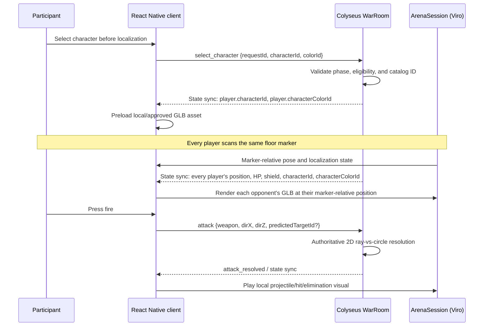

# CodexWars — GLB Character and AR Implementation Specification

**Status:** Implementation specification  
**Companions:** [`../PRD.md`](../PRD.md), [`../BUILD_SPEC.md`](../BUILD_SPEC.md), [`../ARCHITECTURE.md`](../ARCHITECTURE.md)  
**Scope:** M0 marker-colocation spike through P1 selectable GLB characters  
**Last updated:** 2026-07-14

## 1. Purpose and scope

This document specifies how CodexWars renders customizable GLB characters in its React Native AR experience while preserving the game's core rule: **AR is presentation; the server owns the 2D game.**

The PRD establishes the following constraints:

- Every player scans the same printed, asymmetric floor image marker. That marker is the shared arena origin.
- Players lock a stationary marker-relative position before battle. They rotate to aim but do not walk during combat.
- The server receives only marker-relative X/Z positions and a normalized aim direction when an attack is fired. It computes hits, shields, HP, eliminations, and winners.
- Camera frames never leave the device. There is no face/body recognition.
- P0 acceptance requires one bundled fallback GLB avatar after M0 proves Android-to-iPhone marker colocation. The current demo may enable the approved bundled cosmetics as non-blocking presentation work; selection never changes gameplay or the P0 battle gate.

Therefore, a GLB is never a source of gameplay truth. It is a local visual representation of a server-owned `characterId` at a server-owned arena position.

## 2. Technology decisions

| Concern | Decision | Reason |
|---|---|---|
| React Native AR bridge | `@reactvision/react-viro` 2.53.1 | The pinned Expo SDK 54 / React Native 0.81 stack in `BUILD_SPEC.md`; exposes ARKit on iOS and ARCore on Android behind one React Native API. |
| iOS tracking | ARKit, via Viro | ARKit owns camera tracking and image-marker recognition on iPhone. Do not create a parallel direct ARKit integration. |
| Android tracking | ARCore, via Viro | The same `ArenaSession` must work on mixed-platform rooms. |
| Shared origin | `ViroARImageMarker` and the bundled physical arena image | The PRD's deliberate replacement for cloud anchors. |
| 3D format | Binary glTF (`.glb`) | One portable asset file containing meshes, materials, skeleton, animations, and optionally morph targets. |
| Renderer boundary | `apps/mobile/src/ar/` only | No screen, store, network module, or server module may import Viro. |
| Character configuration | Server-synced `characterId` plus a versioned client manifest | All clients render the same selected character without putting asset URLs or AR transforms into combat messages. |

### 2.1 Expo constraint

Viro is native code. The mobile app must run in an installed Expo development build or production build; it cannot run inside Expo Go. Any native dependency or Viro config-plugin change requires rebuilding Android and creating a new iOS EAS development/TestFlight build.

The checked-in baseline is Expo 57.0.4 / React Native 0.86.0. Viro's declared peer range includes this pair, but only a successful M0 development build on both physical platforms proves it for CodexWars.

## 3. Game-aligned behavior

### 3.1 Character selection lifecycle

Character selection is a presentation-only field. It does not change damage, collision radius, range, cooldown, shield, quiz reward, or hit resolution. P0 remains complete with the fallback selection; enabling the approved catalog does not promote Character into gameplay state.



`select_character` is accepted only before the room enters `positioning` (recommended) or before `countdown` (permissible if UI requires it). Once countdown begins, the server freezes `characterId` and `characterColorId` for the match. This prevents late asset loads and ensures the organizer/minimap sees stable player identity.

### 3.2 Same character on every phone

Every client receives the authoritative `characterId` in Colyseus room state. It resolves that ID through the same shipped manifest:

```text
player.characterId = "ember"
  → CHARACTER_CATALOG["ember"]
  → assets/characters/ember/ember.glb
  → render at T_marker × [player.x, AVATAR_HEIGHT_M, player.z]
```

The server does not inspect GLB files and does not know ARKit, ARCore, Viro, mesh names, or camera poses. Its job remains restricted to the PRD's 2D arena and combat rules.

## 4. Asset contract

### 4.1 P0 fallback and enabled cosmetic catalog

The participant demo ships three Quaternius cosmetics: `knight`, `ninja`, and
`wizard`. Each has four approved, pre-baked outfit variants: `gold`, `coral`,
`aqua`, and `violet`. Pre-baking keeps the same appearance on ARKit and ARCore;
remote asset delivery remains a P2 optimization.

```ts
export type CharacterId = "knight" | "ninja" | "wizard";
export type CharacterColorId = "gold" | "coral" | "aqua" | "violet";

export interface CharacterDefinition {
  id: CharacterId;
  displayName: string;
  sources: Record<CharacterColorId, number>; // Metro require() results; no arbitrary URL in P1
  scale: readonly [number, number, number];
  yOffsetM: number;
  idleAnimation: string;
  hitAnimation?: string;
  eliminatedAnimation?: string;
  tintableMaterials?: readonly string[];
}
```

The manifest is the only character lookup surface. UI must not use a raw GLB URL or infer behavior from an asset filename.

### 4.2 GLB authoring requirements

Each production GLB must satisfy all of the following before it is admitted to the catalog:

- glTF 2.0 binary (`.glb`), right-side-up, with consistent forward direction and metre-scale authoring.
- A shared humanoid skeleton or a documented character-specific skeleton. Do not make gameplay depend on a bone name.
- An `Idle` animation clip; optional `Hit` and `Eliminated` clips. Animation names are recorded in the manifest, never guessed at runtime.
- Named material slots for supported visual customization, for example `M_Skin`, `M_Hair`, `M_Outfit`, and `M_Accent`.
- Optional morph targets for cosmetic face/body variation only. Morph target values must never alter the gameplay hit circle.
- Baked lighting kept subtle; AR light estimation is an enhancement, not a requirement for readability.
- No external texture, mesh, animation, or buffer references: all required data is contained in the GLB.
- A documented height and bounding footprint used only for render scale and accessibility review. Gameplay still uses `PLAYER_HIT_RADIUS_M` from shared constants.

### 4.3 Mobile performance budgets

The PRD requires at least 30 FPS on a mid-range Android phone and the designated iPhone. Treat the following as acceptance budgets, then measure on real devices during M2:

| Per character target | Budget |
|---|---:|
| Rendered triangles | ≤15,000 target; ≤25,000 hard cap |
| Materials / draw calls | ≤4 target |
| Texture resolution | 1024 px maximum per map; prefer 512 px where visually acceptable |
| GLB download/bundle size | ≤5 MB target; ≤8 MB hard cap |
| Skin influences | 4 per vertex |
| Simultaneously visible animated characters | 12 maximum |

Use texture compression and mesh compression only after confirming Viro's support for the chosen encoding on both target platforms. A smaller GLB that fails to load on iOS is not an acceptable optimization.

## 5. Repository design

The design extends the layout in `BUILD_SPEC.md` without violating its AR boundary:

```text
apps/mobile/
├── assets/
│   └── characters/
│       ├── knight-gold.glb (plus coral/aqua/violet)
│       ├── ninja-gold.glb  (plus coral/aqua/violet)
│       └── wizard-gold.glb (plus coral/aqua/violet)
└── src/
    ├── ar/
    │   ├── ArenaSession.tsx        # only Viro importer; scene composition
    │   ├── Avatar.tsx              # Viro3DObject wrapper and cosmetic props
    │   ├── characterCatalog.ts     # manifest and pure ID lookup
    │   ├── coordinates.ts           # marker-space math; no GLB knowledge
    │   └── types.ts                 # ArSessionState / ArPose contract
    ├── components/
    │   └── CharacterPicker.tsx      # normal React Native UI, no Viro import
    ├── store/
    │   └── sessionStore.ts
    └── net/
        └── warRoomClient.ts

packages/shared/src/
├── types.ts                         # CharacterId on PlayerState
└── protocol.ts                      # select_character command

apps/server/src/
└── WarRoom.ts                        # validates/freezes character selection
```

`Avatar.tsx` is part of the AR implementation, but it cannot calculate attacks, mutate HP, or send network messages. It receives plain render props: `characterId`, position, facing, HP/shield presentation state, and visual event queue.

## 6. Shared protocol and server behavior

### 6.1 State additions

Add a required, server-owned selection field to `PlayerState`:

```ts
interface PlayerState {
  // Existing server-owned fields: position, hp, shield, eliminated, etc.
  characterId: CharacterId;
  characterColorId: CharacterColorId;
}
```

New players begin with the catalog fallback (`characterId: "knight"`, `characterColorId: "gold"` in the current manifest). This guarantees a valid representation when the participant does not customize.

### 6.2 Command

```ts
type SelectCharacter = {
  type: "select_character";
  requestId: string;
  characterId: CharacterId;
  colorId: CharacterColorId;
};
```

Server handler rules, in order:

1. Require the sender to be an active participant, not organizer-only/observer.
2. Require phase `lobby`, `quiz`, or `localization` (the final allowed list is a shared constant).
3. Require the `characterId`/`colorId` pair to appear in the server's allow-list, which is generated from the shared catalog—not supplied by the client.
4. Set `player.characterId` and `player.characterColorId`, then allow normal Colyseus state synchronization.
5. Reject any invalid phase or ID with a typed error; do not silently substitute another character.

The server must not accept `glbUrl`, mesh customization, a transform, a scale, a hitbox, an animation name, or any Battle Stats from this message. The complete command/error contract is defined in `API_AND_REALTIME_SPEC.md`.

### 6.3 Cosmetic customization

P1's safe customization is a constrained `CharacterAppearance` record, such as palette IDs and optional accessory IDs, validated against a catalog. It is synchronized beside `characterId` and used only by `Avatar.tsx`.

```ts
interface CharacterAppearance {
  outfitColorId: "blue" | "gold" | "purple";
  accessoryId?: "visor" | "cape";
}
```

Do not permit arbitrary user-uploaded GLBs in the hackathon/product P1 path. They introduce unacceptable asset validation, copyright, performance, and security work. If user-created characters become a product feature, process uploads offline, validate/optimize them, assign an immutable approved asset version, and distribute only the approved result.

## 7. ARKit/ARCore scene implementation

### 7.1 Lifecycle

`ArenaSession` mounts only on Marker Scan, Position Lock, and Battle screens. It unmounts everywhere else to meet the PRD's three-minute camera budget.

1. Initialize the Viro AR scene.
2. Register the bundled floor-marker image at its true physical width (A4: `0.297 m`) through the Viro tracking-target API.
3. Render `ViroARImageMarker` for the arena target.
4. On acquisition, record `T_marker`: the marker pose in this device's private AR world.
5. Publish `ArSessionState = localized` and report the coarse state to the server through `localization_changed`.
6. Convert local camera pose/forward vector to marker space at approximately 10 Hz; publish plain `ArPose` data with `observedAt` and `quality: tracked | inertial` to `battleStore`.
7. Render each synchronized opponent under the marker node using their marker-relative X/Z coordinates.
8. When the marker leaves view but world tracking still supplies fresh inertial poses, publish local `degraded` quality and continue with a warning. If no pose is available or it is older than `AIM.POSE_STALE_MS`, publish `lost`, disable firing locally, retain only the locked server position/last transform for presentation, show re-scan guidance, and do not pause the shared P0 match. Never emit an attack from a frozen last-known aim.

### 7.2 Coordinate rules

For every device:

```text
marker-space camera position = inverse(T_marker) × local camera position
marker-space aim direction  = normalize(projectFloor(inverse(rotation(T_marker)) × cameraForward))
opponent render transform   = T_marker × [opponent.x, AVATAR_HEIGHT_M, opponent.z]
```

Only the first two values cross the AR boundary. Only locked position and aim-on-attack cross the network boundary. GLB vertices, bones, animations, and ARKit/ARCore matrices must never cross either boundary.

### 7.3 Avatar rendering rules

For each `PlayerState`:

- Place the avatar at `[x, AVATAR_HEIGHT_M + yOffsetM, z]` under the marker anchor.
- Billboard the name/HP/shield label toward the local camera; the character mesh may face its gameplay heading or the camera according to the visual direction chosen in playtest.
- Play `Idle` while alive and stationary. Trigger `Hit` only from an authoritative `attack_resolved` event. Trigger `Eliminated` only when server state marks that player eliminated.
- Do not hide or move the avatar based on a local predicted hit. Prediction may highlight a target, but only server results create persistent effects.
- P0 always renders the bundled `default` GLB after M0 go/conditional-go. A recoverable local error state may substitute a simple placeholder only when the asset fails to load; it cannot alter gameplay.

### 7.4 Illustrative component boundary

The exact Viro API options must be checked against the pinned 2.53.1 documentation while implementing, but the ownership shape is fixed:

```tsx
function Avatar({ player, visualEvent }: AvatarProps) {
  const definition = getCharacterDefinition(player.characterId);

  return (
    <Viro3DObject
      source={definition.glb}
      type="GLB"
      position={[player.position.x, definition.yOffsetM, player.position.z]}
      scale={definition.scale}
      animation={{ name: definition.idleAnimation, run: !player.eliminated, loop: true }}
    />
  );
}
```

This example intentionally omits networking, coordinate conversion, attack resolution, and unvalidated remote URLs: those do not belong in the avatar component.

## 8. Effects, aiming, and collision

Visual GLB projectiles may be used, but projectile motion is an animation of an already-authoritative event.

1. Player presses the basic-bolt button.
2. Client projects the latest marker-relative camera-forward vector onto the X/Z floor plane, normalizes it, and sends the existing `attack` command. Vertical pitch is discarded, so aiming above or below a player's rendered head has no gameplay effect when the floor-plane direction is unchanged.
3. Server performs the PRD's nearest ray-vs-circle test using canonical `PLAYER_HIT_RADIUS_M` and weapon ray width.
4. Server broadcasts the result.
5. Clients draw a bolt/flash toward the server-confirmed target position (or a short miss effect for `targetId: null`).

No character mesh collider, bone collider, GLB bounding box, avatar height, or ARKit raycast result can change whether an attack hits. The server considers only the floor-plane ray, canonical player circle, weapon radius, and range; it selects the nearest eligible circle. This keeps mixed-device matches deterministic despite image-marker jitter and different client asset detail.

If floor projection produces a vector below `AIM.MIN_HORIZONTAL_MAGNITUDE`, the client disables fire with an "aim level" cue and sends no attack. This is the only camera-pitch constraint; it is not a mesh or screen-space target check.

## 9. Delivery plan and acceptance criteria

| Milestone | GLB/AR work | Exit criterion |
|---|---|---|
| M0 | No character work required; marker scene may use a simple diagnostic primitive | Android and iPhone meet the marker acquisition, agreement, drift, and tracking-loss thresholds in `BUILD_SPEC.md`. |
| M1 / P0 | Render the bundled default GLB; validate AR boundary, coordinate conversion, and full battle on 3–4 devices | The four PRD demo success criteria pass twice in a row. |
| M2 / P1 | Add three bundled cosmetic GLBs, picker, catalog validation, preloading, hit/elimination animations, and performance instrumentation | All P1 GLBs load on an ARKit iPhone and ARCore Android; 12-avatar worst case sustains ≥30 FPS; no gameplay test changes across GLB cosmetics. |
| P2 | Consider approved remote catalog/versioning and richer cosmetics | Offline/demo fallback still works with bundled assets; asset failure has a visible fallback, not a broken battle screen. |

Required tests:

- Unit-test catalog ID validation and fallback behavior.
- Unit-test coordinate conversions independently of Viro.
- Unit-test pose freshness so tracked/inertial poses may fire and stale/unavailable poses may not.
- Server integration-test phase gates and rejection of invalid `select_character` IDs.
- Regression-test combat with different `characterId` values and prove identical damage/winner outcomes.
- Device-test marker reacquisition, GLB asset loading, animation playback, 3–4 real devices, then 12 simulated/real render load as available.
- Test ARKit and ARCore separately for marker scale/orientation, asset load failures, and tracking-loss behavior.

## 10. Explicit non-goals

- ARKit-only or Android-only gameplay paths.
- Cloud anchors, camera upload, facial recognition, body tracking, or recognition of people.
- Full 3D physics or GLB-driven hitboxes.
- User-uploaded/unreviewed models in P1.
- Character choices that give combat advantages before the PRD's future loadout-economy work is designed and approved.

## 11. Implementation checklist

1. Complete M0 before rendering the P0 default GLB; M0 itself uses diagnostic primitives only.
2. Add `CharacterId` and default selection to shared/server schema; test phase-gated selection.
3. Add the bundled GLB catalog and Metro asset configuration; verify native dev builds on both platforms.
4. Implement `Avatar.tsx` exclusively inside `src/ar/`, rendering the bundled default GLB and only a recoverable placeholder on local asset failure.
5. Preload the selected character before positioning; block readiness with a recoverable asset-error message if it cannot load.
6. Connect authoritative combat events to visual animation/effect queues only after server broadcast.
7. Profile 3–4 devices in a real room, then enforce the M2 performance budget.
8. Update `M0_RESULTS.md` / milestone evidence and only then enable the default GLB in the production demo flow.
