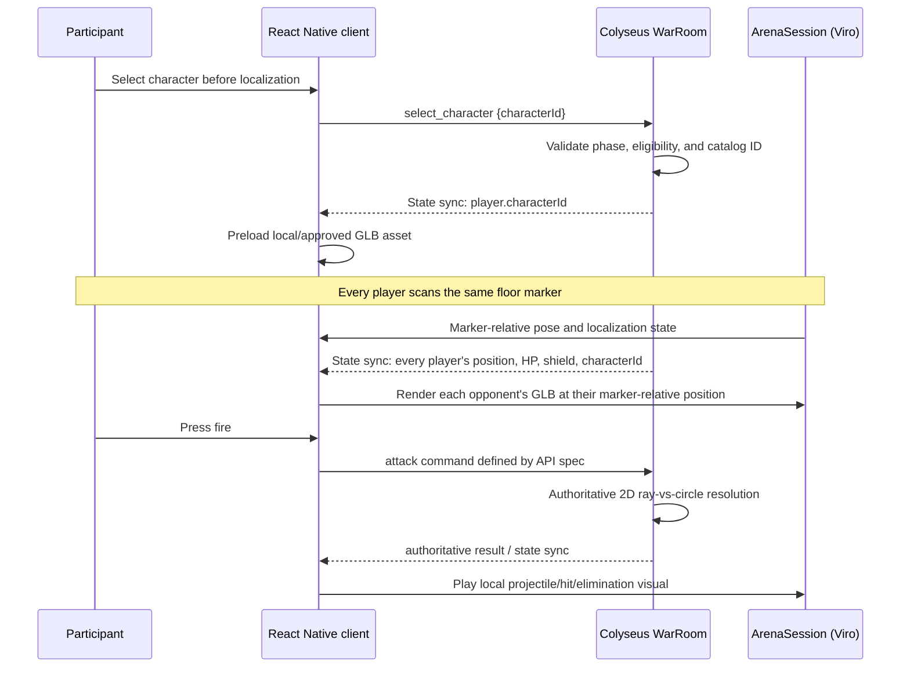

# CodexWars — GLB Character and AR Implementation Specification

**Status:** Authoritative AR/device and GLB contract
**Companions:** [`../PRD.md`](../PRD.md), [`../BUILD_SPEC.md`](../BUILD_SPEC.md), [`../ARCHITECTURE.md`](../ARCHITECTURE.md), [`../API_AND_REALTIME_SPEC.md`](../API_AND_REALTIME_SPEC.md)
**Scope:** M0 marker-colocation spike through P1 selectable GLB characters
**Last updated:** 2026-07-14

## 1. Purpose and scope

This document owns marker acquisition, marker-space pose conversion, pose freshness, AR lifecycle, GLB asset constraints, and local rendering. Product rules, server authority, and wire payloads stay in their companion documents. A GLB is presentation of server-owned state, never gameplay truth.

## 2. Technology decisions

| Concern | Decision | Reason |
|---|---|---|
| React Native AR bridge | The `@reactvision/react-viro` version pinned in `BUILD_SPEC.md` | Exposes ARKit and ARCore behind one React Native boundary. |
| iOS tracking | ARKit, via Viro | ARKit owns camera tracking and image-marker recognition on iPhone. Do not create a parallel direct ARKit integration. |
| Android tracking | ARCore, via Viro | The same `ArenaSession` must work on mixed-platform rooms. |
| Shared origin | `ViroARImageMarker` and the bundled physical arena image | The PRD's deliberate replacement for cloud anchors. |
| 3D format | Binary glTF (`.glb`) | One portable asset file containing meshes, materials, skeleton, animations, and optionally morph targets. |
| Renderer boundary | `apps/mobile/src/ar/` only | No screen, store, network module, or server module may import Viro. |
| Character configuration | Server-synced `characterId` plus a versioned client manifest | All clients render the same approved character without putting asset URLs or transforms into combat messages. |

### 2.1 Expo constraint

Viro is native code. The mobile app must run in an installed Expo development build or production build; it cannot run inside Expo Go. Any native dependency or Viro config-plugin change requires rebuilding Android and creating a new iOS EAS development/TestFlight build.

The checked-in Expo/React Native versions are owned by `BUILD_SPEC.md`. Only a successful M0 development build on both physical platforms proves the pinned combination for CodexWars.

## 3. Game-aligned behavior

### 3.1 Character selection lifecycle

Character selection is a P1 presentation/loadout field. It does not change damage, collision radius, range, cooldown, shield, quiz reward, or hit resolution.



`select_character` is accepted only during `lobby`, `quiz`, or `localization`. Entering `positioning` freezes `characterId` for the round, preventing late asset loads and keeping player identity stable.

### 3.2 Same character on every phone

Every client receives the authoritative `characterId` in Colyseus room state. It resolves that ID through the same shipped manifest:

```text
player.characterId = "ember"
  → CHARACTER_CATALOG["ember"]
  → assets/characters/ember/ember.glb
  → render at T_marker × [player.x, AVATAR_HEIGHT_M, player.z]
```

The server does not inspect GLB files and does not know ARKit, ARCore, Viro, mesh names, or camera poses. Its job remains restricted to the PRD's 2D arena and combat rules.

## 4. Asset contract

### 4.1 P0 default and P1 catalog

Ship the `default` GLB with P0. P1 adds the three approved cosmetic characters `ember`, `moss`, and `nova`. Remote asset delivery is a P2 optimization and must retain a bundled fallback for the demo.

```ts
export type CharacterId = "default" | "ember" | "moss" | "nova";

export interface CharacterDefinition {
  id: CharacterId;
  displayName: string;
  glb: number; // Metro require() result; no arbitrary URL in P1
  scale: readonly [number, number, number];
  yOffsetM: number;
  idleAnimation: string;
  hitAnimation?: string;
  eliminatedAnimation?: string;
  tintableMaterials?: readonly string[];
}
```

The manifest is the only character lookup surface. UI must not use a raw GLB URL or infer behavior from an asset filename.

### 4.2 GLB authoring requirements

Each production GLB must satisfy all of the following before it is admitted to the catalog:

- glTF 2.0 binary (`.glb`), right-side-up, with consistent forward direction and metre-scale authoring.
- A shared humanoid skeleton or a documented character-specific skeleton. Do not make gameplay depend on a bone name.
- An `Idle` animation clip; optional `Hit` and `Eliminated` clips. Animation names are recorded in the manifest, never guessed at runtime.
- Named material slots for supported visual customization, for example `M_Skin`, `M_Hair`, `M_Outfit`, and `M_Accent`.
- Optional morph targets for cosmetic face/body variation only. Morph target values must never alter the gameplay hit circle.
- Baked lighting kept subtle; AR light estimation is an enhancement, not a requirement for readability.
- No external texture, mesh, animation, or buffer references: all required data is contained in the GLB.
- A documented height and bounding footprint used only for render scale and accessibility review. Gameplay still uses `PLAYER_HIT_RADIUS_M` from shared constants.

### 4.3 Mobile performance budgets

The PRD requires at least 30 FPS on a mid-range Android phone and the designated iPhone. Treat the following as acceptance budgets, then measure on real devices during M2:

| Per character target | Budget |
|---|---:|
| Rendered triangles | ≤15,000 target; ≤25,000 hard cap |
| Materials / draw calls | ≤4 target |
| Texture resolution | 1024 px maximum per map; prefer 512 px where visually acceptable |
| GLB download/bundle size | ≤5 MB target; ≤8 MB hard cap |
| Skin influences | 4 per vertex |
| Simultaneously visible animated characters | 12 maximum |

Use texture compression and mesh compression only after confirming Viro's support for the chosen encoding on both target platforms. A smaller GLB that fails to load on iOS is not an acceptable optimization.

## 5. Repository design

The repository layout is owned by `BUILD_SPEC.md`. The AR-specific rules are:

- Viro scene composition, avatar rendering, the client manifest, coordinate math, and AR types stay under `apps/mobile/src/ar/`.
- Ordinary React Native pickers/HUD components consume plain props and do not import Viro.
- `apps/mobile/src/lib/warRoomClient.ts` is the network boundary and never imports Viro types.
- Shared/server modules know approved character IDs but never import GLBs, Viro, or mobile asset handles.

`Avatar.tsx` is part of the AR implementation, but it cannot calculate attacks, mutate HP, or send network messages. It receives plain render props: `characterId`, position, facing, HP/shield presentation state, and visual event queue.

## 6. Shared protocol and server behavior

### 6.1 State additions

Add a required, server-owned selection field to `PlayerState`:

```ts
interface PlayerState {
  // Existing server-owned fields: position, hp, shield, eliminated, etc.
  characterId: CharacterId;
}
```

New players begin with `characterId: "default"`. This is backwards-compatible with P0 and guarantees a valid representation if P1 assets are not enabled.

### 6.2 Command

```ts
type SelectCharacter = {
  type: "select_character";
  characterId: CharacterId;
};
```

Server handler rules, in order:

1. Require the sender to be an active participant, not organizer-only/observer.
2. Require phase `lobby`, `quiz`, or `localization` (the final allowed list is a shared constant).
3. Require `characterId` to appear in the server's allow-list, which is generated from the shared catalog IDs—not supplied by the client.
4. Set `player.characterId` and allow normal Colyseus state synchronization.
5. Reject any invalid phase or ID with a typed error; do not silently substitute another character.

The server must not accept `glbUrl`, mesh customization, a transform, a scale, a hitbox, or an animation name from this message.

### 6.3 Cosmetic customization

P1's customization is a constrained palette ID validated against the approved manifest. It is synchronized beside `characterId` and used only by `Avatar.tsx`.

```ts
interface CharacterAppearance {
  paletteId: "default" | "blue" | "gold" | "purple";
}
```

Do not permit arbitrary user-uploaded GLBs in the hackathon/product P1 path. They introduce unacceptable asset validation, copyright, performance, and security work. If user-created characters become a product feature, process uploads offline, validate/optimize them, assign an immutable approved asset version, and distribute only the approved result.

## 7. ARKit/ARCore scene implementation

### 7.1 Lifecycle

`ArenaSession` mounts only on Marker Scan, Position Lock, and Battle screens. It unmounts everywhere else to meet the PRD's three-minute camera budget.

1. Initialize the Viro AR scene.
2. Register the bundled floor-marker image at its true physical width (A4: `0.297 m`) through the Viro tracking-target API.
3. Render `ViroARImageMarker` for the arena target.
4. On acquisition, record `T_marker`: the marker pose in this device's private AR world.
5. Publish `ArSessionState = localized` and report the coarse state to the server through `localization_changed`.
6. Convert local camera pose/forward vector to marker space at approximately 10 Hz; publish plain `ArPose` data with `observedAt` and `quality: tracked | inertial` to `battleStore`.
7. Render each synchronized opponent under the marker node using their marker-relative X/Z coordinates.
8. When the marker leaves view but world tracking still supplies fresh inertial poses, publish local `degraded` quality and continue with a warning. If no pose is available or it is older than `AIM.POSE_STALE_MS`, publish `lost`, disable firing locally, retain only the locked server position/last transform for presentation, show re-scan guidance, and do not pause the shared P0 match. Never emit an attack from a frozen last-known aim.

### 7.2 Coordinate rules

For every device:

```text
marker-space camera position = inverse(T_marker) × local camera position
marker-space aim direction  = normalize(projectFloor(inverse(rotation(T_marker)) × cameraForward))
opponent render transform   = T_marker × [opponent.x, AVATAR_HEIGHT_M, opponent.z]
```

Only the first two values cross the AR boundary. Only locked position and aim-on-attack cross the network boundary. GLB vertices, bones, animations, and ARKit/ARCore matrices must never cross either boundary.

### 7.3 Avatar rendering rules

For each `PlayerState`:

- Place the avatar at `[x, AVATAR_HEIGHT_M + yOffsetM, z]` under the marker anchor.
- Billboard the name/HP/shield label toward the local camera; the character mesh may face its gameplay heading or the camera according to the visual direction chosen in playtest.
- Play `Idle` while alive and stationary. Trigger `Hit` only from an authoritative `attack_resolved` event. Trigger `Eliminated` only when server state marks that player eliminated.
- Do not hide or move the avatar based on a local predicted hit. Prediction may highlight a target, but only server results create persistent effects.
- P0 always renders the bundled `default` GLB after M0 go/conditional-go. A recoverable local error state may substitute a simple placeholder only when the asset fails to load; it cannot alter gameplay.

### 7.4 Illustrative component boundary

The exact Viro API options must be checked against the pinned 2.57.4 documentation while implementing, but the ownership shape is fixed:

```tsx
function Avatar({ player, visualEvent }: AvatarProps) {
  const definition = getCharacterDefinition(player.characterId);

  return (
    <Viro3DObject
      source={definition.glb}
      type="GLB"
      position={[player.position.x, definition.yOffsetM, player.position.z]}
      scale={definition.scale}
      animation={{ name: definition.idleAnimation, run: !player.eliminated, loop: true }}
    />
  );
}
```

This example intentionally omits networking, coordinate conversion, attack resolution, and unvalidated remote URLs: those do not belong in the avatar component.

## 8. Effects and aiming

- Fire uses only a fresh normalized floor-projected aim produced by the AR adapter; otherwise the UI disables fire with an “aim level” or re-scan cue.
- The network command and server resolution are defined only in `API_AND_REALTIME_SPEC.md`.
- Bolt, hit, and elimination visuals react to authoritative events/state. A local predicted target may affect highlighting only.
- Meshes, bones, GLB bounds, avatar height, ARKit raycasts, and visual projectile paths never affect collision.

## 9. Conformance requirements

- Unit-test catalog validation, coordinate conversion, and pose freshness independently of Viro.
- Device-test marker scale/orientation, acquisition, reacquisition, drift, and tracking loss on the designated Android and iPhone.
- Verify the P0 default GLB and every enabled P1 GLB load and animate on both platforms within the asset/performance budgets.
- Prove character choice and visual asset failure do not change server damage, elimination, or winner results.
- Prove stale/unavailable poses emit no attack and authoritative events alone drive persistent hit/elimination effects.

## 10. Explicit non-goals

- ARKit-only or Android-only gameplay paths.
- Cloud anchors, camera upload, facial recognition, body tracking, or recognition of people.
- Full 3D physics or GLB-driven hitboxes.
- User-uploaded/unreviewed models in P1.
- Character choices that give combat advantages before the PRD's future loadout-economy work is designed and approved.
