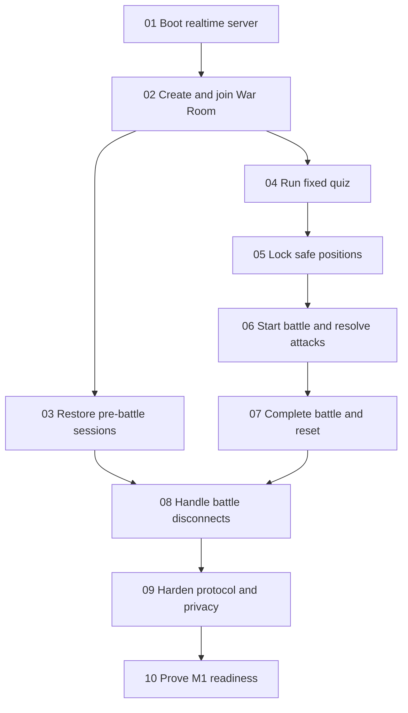

# CodexWars P0 Backend Implementation Checklist

**Status:** Approved execution index
**Tracker:** Local Markdown
**Scope:** P0 authoritative server and shared backend contract

This index links the tracer-bullet tickets produced from the active CodexWars specifications. Acceptance criteria live only in the ticket files; this page provides navigation, dependencies, and the current frontier.

## Source contracts

- [`../PRD.md`](../PRD.md) — product behavior and game rules
- [`../BUILD_SPEC.md`](../BUILD_SPEC.md) — stack, environment, and milestone gates
- [`../ARCHITECTURE.md`](../ARCHITECTURE.md) — boundaries, state ownership, and invariants
- [`../API_AND_REALTIME_SPEC.md`](../API_AND_REALTIME_SPEC.md) — exact P0 backend contract

## Dependency graph

## Tickets

| Ticket | Blocked by | Status |
|---|---|---|
| [01 — Boot the P0 realtime server](../.scratch/p0-backend/issues/01-boot-p0-realtime-server.md) | None | ready-for-agent |
| [02 — Create and join a nickname-only War Room](../.scratch/p0-backend/issues/02-create-and-join-war-room.md) | 01 | ready-for-agent |
| [03 — Restore pre-battle sessions after network drops](../.scratch/p0-backend/issues/03-restore-pre-battle-sessions.md) | 02 | ready-for-agent |
| [04 — Run the fixed quiz and award shields](../.scratch/p0-backend/issues/04-run-fixed-quiz-and-award-shields.md) | 02 | ready-for-agent |
| [05 — Configure the combat cohort and lock safe positions](../.scratch/p0-backend/issues/05-lock-safe-combat-positions.md) | 04 | ready-for-agent |
| [06 — Start a synchronized battle and resolve bolt attacks](../.scratch/p0-backend/issues/06-start-battle-and-resolve-bolt-attacks.md) | 05 | ready-for-agent |
| [07 — Complete battles deterministically and reset rounds](../.scratch/p0-backend/issues/07-complete-battle-and-reset-round.md) | 06 | ready-for-agent |
| [08 — Handle battle disconnects without corrupting results](../.scratch/p0-backend/issues/08-handle-battle-disconnects.md) | 03, 07 | ready-for-agent |
| [09 — Harden protocol, privacy, and abuse boundaries](../.scratch/p0-backend/issues/09-harden-protocol-privacy-abuse.md) | 08 | ready-for-agent |
| [10 — Prove backend M1 readiness with 12 participants](../.scratch/p0-backend/issues/10-prove-backend-m1-readiness.md) | 09 | ready-for-agent |

## Working rule

Start only tickets whose blockers are complete. Ticket 01 is the initial frontier. After Ticket 02, Tickets 03 and 04 may run in parallel. Update the ticket’s status and acceptance checkboxes as evidence lands; do not copy acceptance criteria into this index.
