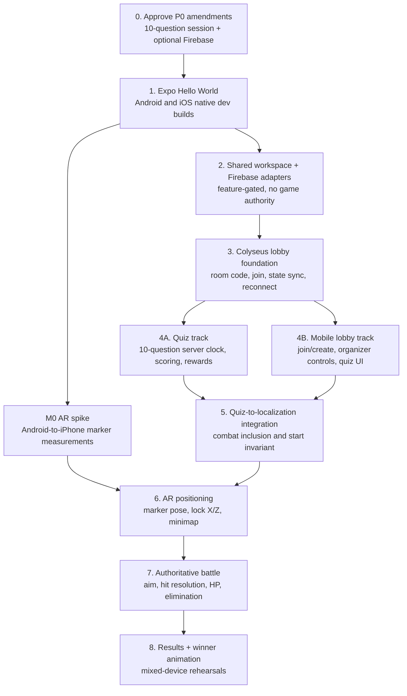

# CodexWars — P0 Implementation Plan

**Status:** Execution plan — no feature implementation has started from this plan  
**Last updated:** 2026-07-14  
**Sources of truth:** [`PRD.md`](../PRD.md), [`BUILD_SPEC.md`](../BUILD_SPEC.md), [`ARCHITECTURE.md`](../ARCHITECTURE.md), and [`AR_IMPLEMENTATION_SPEC.md`](AR_IMPLEMENTATION_SPEC.md)

`CODEXWARS_PRD_TDD.md` is retired historical material. If it differs from an active document, the active document wins.

## 1. Scope decisions and guardrails

This plan preserves the current product architecture while incorporating the requested quiz flow.

1. **P0 is mixed-platform.** Every device milestone requires one physical ARCore Android phone and one physical ARKit iPhone. Android builds locally; iOS development and rehearsal builds use EAS/TestFlight.
2. **Live authority stays in Colyseus.** The `WarRoom` is the sole writer for room phase, quiz clock, answers/scores, rewards, positions, HP, eliminations, and winner. Firebase never resolves a game action.
3. **Firebase is optional persistence, not a P0 dependency.** Firebase JS is initialized behind configuration in the React Native app; Firebase Admin is available only behind a server repository interface. The LAN demo must run with no Firebase configuration or internet connection.
4. **“Organizer creates a quiz” means creates a quiz session from the bundled ten-question Programming Fundamentals quiz.** The organizer may name the session and start it, but arbitrary question authoring remains P2 per the PRD. This avoids accidentally adding accounts, permissions, and a content-management system to P0.
5. **The requested ten-question flow supersedes the former three-question demo count.** Before implementation, update the PRD/Build Spec to make this an approved P0 amendment. The deterministic shield-only reward economy remains unchanged in principle.
6. **P0 AR uses the default sprite/avatar.** The GLB character pipeline in `AR_IMPLEMENTATION_SPEC.md` is P1/M2 work. P0 may use simple Viro primitives only for the M0 tracking diagnostic.
7. **Area scan means marker acquisition, not room meshing.** The client guides the user to scan the printed asymmetric A4 marker and nearby visual features until it obtains `T_marker`; it does not reconstruct the room or detect people.

## 2. Dependency graph and execution order

The user-visible order is: Hello World → Firebase JS + multiplayer foundation → quiz in parallel → full AR/gameplay. The technical order additionally starts the small M0 AR spike as soon as the first native builds exist, because marker colocation is the only project-killing uncertainty.



`E` is a hard gate: if M0 is a no-go, stop AR P0 and obtain an explicit revised-product decision. Do not build rich AR gameplay around an unproven coordinate system.

## 3. Target repository structure

```text
apps/
  mobile/                         # Expo React Native app
    src/
      app/                        # navigation and app composition
      screens/                    # Home, Lobby, Quiz, Rewards, AR, Battle, Results
      components/                 # plain RN UI; no Viro imports
      ar/                         # the only Viro importer
      net/                        # @colyseus/sdk client wrapper
      firebase/                   # feature-gated Firebase JS initialization
      store/                      # sessionStore and battleStore
  server/                         # Node/TypeScript Colyseus server
    src/
      rooms/WarRoom.ts
      schema/                     # Colyseus state definitions
      quiz/                       # question bank, scoring, repository interface
      persistence/                # in-memory default; optional Firestore adapter
      firebase.ts                 # Admin initialization only for optional adapter
packages/
  shared/
    src/
      protocol.ts
      types.ts
      constants.ts
      geometry.ts
      combat.ts
      rewards.ts
      quiz.ts
docs/
  M0_RESULTS.md                   # created only after the device spike
  device-test.md
```

## 4. Phase 0 — approve and prepare

### 4.1 Amend the active specifications before code

Record these decisions in `PRD.md` and `BUILD_SPEC.md`:

- P0 quiz is a **bundled ten-question Programming Fundamentals session** created and started by the organizer.
- Standard questions use a 30-second server clock; difficult questions use 45 seconds.
- Firebase is optional and non-authoritative; P0 live play remains LAN-only and in-memory.
- Replace the legacy `colyseus.js` 0.16 client recommendation with a pinned `@colyseus/sdk` version compatible with Colyseus 0.17, then lock and test the exact pair.

### 4.2 Accounts, devices, and configuration

- Obtain an ARCore-certified Android test phone and a designated ARKit-compatible iPhone.
- Configure the Expo account, EAS project, Apple Developer signing, iPhone registration, and internal TestFlight access.
- Prepare a non-isolated hotspot and record the Windows laptop’s private LAN IP.
- Add `.env.example` entries for the local server URL and optional Firebase client/server configuration. No secrets enter source control.
- Set up CI for typecheck, unit tests, and server integration tests. Device testing remains a dated manual checklist.

**Exit:** both native development builds can display the same static app screen on their physical devices.

## 5. Phase 1 — scaffold the React Native Hello World app

This is intentionally the first implementation task.

### Deliverables

1. Create `apps/mobile` with Expo SDK 56, TypeScript strict mode, React Navigation, and a single `HomeScreen` that renders **“CodexWars — Hello World”**.
2. Add a minimal app shell with a status line showing build platform and app version.
3. Configure the Viro Expo plugin but do not mount an AR scene yet.
4. Build and install:
   - Android local development build.
   - iOS EAS development build on the registered iPhone.
5. Add a smoke test/checklist proving that the same navigation shell launches on both platforms.

### Acceptance criteria

- No Expo Go dependency.
- Android and iPhone both run the installed development build.
- Navigation, TypeScript build, and a basic component test are green.
- Any native config change has a documented Android rebuild and iOS EAS-build step.

## 6. Phase 2 — Firebase JS and multiplayer foundation

### 6.1 Firebase integration: constrained role

Implement Firebase in two separate adapters:

| Adapter | Runs in | P0 responsibility | Explicitly must not do |
|---|---|---|---|
| `mobile/src/firebase/client.ts` | React Native | Initialize Firebase JS only when public config exists; expose an optional quiz-template read client for development/admin tooling | Store player positions, answers, HP, room phase, or combat events |
| `server/src/persistence/firestoreQuizRepository.ts` | Node server | Optional durable storage for organizer-created session metadata or approved quiz templates after a server-side decision | Become the source of truth for an active room or be required for LAN demo play |

Use an interface from day one:

```ts
interface QuizRepository {
  getTemplate(templateId: string): Promise<QuizTemplate | null>;
  saveSessionMetadata?(metadata: CompletedQuizMetadata): Promise<void>;
}
```

`InMemoryQuizRepository` is the P0 default. `FirestoreQuizRepository` is selected only by server configuration. Participants have no direct Firestore writes and no Firebase account requirement.

### 6.2 Shared game contract

Create `packages/shared` before the server or screens grow:

- `RoomPhase = lobby | quiz | localization | positioning | countdown | battle | results`.
- `PlayerState` with nickname, role, `combatIncluded`, `quizCompleted`, `quizScore`, shield/HP, position, ready, connected, and eliminated fields.
- `QuizState` with a public current question snapshot, `questionIndex`, `questionEndsAt`, `status`, and public score/reward summaries after completion.
- Server-private answer keys only; never sync correct answers before expiry.
- Constants for capacity (12), countdown (5 s), battle (60 s), reconnect grace (20 s), question/reveal durations, shield rewards, and all combat values.

### 6.3 Colyseus room foundation

Implement `WarRoom` and a mobile `warRoomClient` wrapper using the pinned `@colyseus/sdk`.

- Four-digit code allocation; no active collisions; two-hour idle expiry.
- `create_room`, `join_room`, duplicate nickname suffixing, capacity rejection, `set_combat_included`, and typed errors.
- State synchronization for public room/player state and `serverNow`/`startsAt` time offset.
- `onDrop` → `allowReconnection` → `onReconnect` lifecycle. Disable controls while disconnected and discard queued attack commands on reconnect.
- Lobby UI: create/join form, code display, live roster, connection state, quiz-only toggle, and organizer-only phase controls.

### Acceptance criteria

- An Android and iPhone can join the same laptop-hosted room over the hotspot.
- Both render the same roster/phase and reconnect to the same player record.
- Firebase disabled does not prevent the room or quiz template from working.
- No active combat or quiz state is written directly by Firebase clients.

## 7. Phase 3 — hosted ten-question Programming Fundamentals quiz

This work starts after the multiplayer contract exists and can run in parallel with the M0 AR spike and mobile lobby polish.

### 7.1 Quiz session behavior

1. Organizer creates a room and selects **Programming Fundamentals — 10 questions**.
2. This creates an in-memory `QuizSession` from the bundled template and optionally records metadata through the repository.
3. Organizer presses **Start Quiz**. The server freezes the participant cohort and sets `phase = quiz`.
4. The server broadcasts only one public question at a time and authoritative `questionEndsAt`.
5. Each participant may submit exactly one selected option before the deadline. Late, duplicate, malformed, or wrong-phase submissions receive a typed error and do not change score.
6. At expiry, the server scores all submissions, reveals the correct answer and explanation for five seconds, then advances automatically. The organizer can use **Next** only after the reveal; it cannot extend a live deadline.
7. After question 10, the server calculates shield rewards, marks quiz completion, and moves the room to localization.

### 7.2 Time model

All time is server-owned. The client renders `questionEndsAt - (localNow + serverTimeOffset)`.

| Question tier | Count | Time each | Reveal | Total active time |
|---|---:|---:|---:|---:|
| Basic/intermediate | 7 | 30 s | 5 s | 4 m 05 s |
| Difficult | 3 | 45 s | 5 s | 2 m 30 s |
| **Quiz total** | **10** | — | — | **6 m 35 s** |

This leaves enough time inside the PRD’s under-15-minute organizer goal for joining, localization, a 60-second battle, and results.

### 7.3 Bundled question bank

Use one versioned, server-owned template: `programming-fundamentals-v1`. It is fixed for P0; the organizer creates a session from it rather than authoring arbitrary question text. The answer key stays server-private until each question has expired.

| # | Tier / time | Question | Options | Correct answer | Reveal explanation |
|---:|---|---|---|---|---|
| 1 | Basic / 30 s | `let x = 3; x = x + 2;` What is `x`? | 3, 5, 6, error | 5 | The assignment replaces the old value with `3 + 2`. |
| 2 | Basic / 30 s | What is the type of `true`? | string, number, boolean, object | boolean | `true` and `false` are boolean values. |
| 3 | Basic / 30 s | What does `if (7 > 10) { "A" } else { "B" }` select? | A, B, both, neither | B | `7 > 10` is false, so the `else` branch runs. |
| 4 | Basic / 30 s | How many times does `for (let i = 0; i < 4; i++)` run? | 3, 4, 5, infinitely | 4 | It runs for `i = 0, 1, 2, 3`. |
| 5 | Basic / 30 s | `function triple(n) { return n * 3; }` What is `triple(4)`? | 7, 12, 16, undefined | 12 | The function returns its input multiplied by three. |
| 6 | Intermediate / 30 s | Given `const a = [10, 20, 30]`, what is `a[1]`? | 10, 20, 30, undefined | 20 | Array indexes begin at zero. |
| 7 | Intermediate / 30 s | `const user = { name: "Ada", level: 1 }; user.level = 2;` What is `user.name`? | Ada, 1, 2, undefined | Ada | Updating one object property does not change another property. |
| 8 | Difficult / 45 s | `const a = { score: 1 }; const b = a; b.score = 4;` What is `a.score`? | 1, 4, undefined, error | 4 | Both variables refer to the same object. |
| 9 | Difficult / 45 s | A loop runs `n` times and, inside it, another loop also runs `n` times. What is the usual time complexity? | O(1), O(n), O(n log n), O(n²) | O(n²) | The body executes roughly `n × n` times. |
| 10 | Difficult / 45 s | What must be true before using binary search correctly? | The list is sorted, the list has no duplicates, the list is all numbers, the list has exactly 10 items | The list is sorted | Binary search discards half based on ordering. |

The implementation stores these question objects in `server/quiz/programmingFundamentalsV1.ts`, serves a public projection without `correctOptionId`, and sends the correct answer/explanation only in the five-second reveal state.

### 7.4 Reward mapping for ten questions

P0 retains basic bolt plus shield only:

| Correct answers | Starting shield |
|---:|---:|
| 0–2 | 0 |
| 3–4 | 10 |
| 5–6 | 20 |
| 7–8 | 30 |
| 9–10 | 40 |

Every player starts with 100 HP. Shield is additive protection, not additional HP; the quiz winner is favoured but not guaranteed to win.

### 7.5 Quiz modules and tests

- `shared/quiz.ts`: immutable template types, public question projection, score/reward calculation.
- `server/quiz/session.ts`: deadlines, answer recording, reveal transition, completion.
- `mobile/screens/QuizScreen.tsx`: question, server-clock timer, option selection, submitted state, reveal state.
- Unit tests: no correct answer leaks, deadline boundary, duplicate submission, reward bands, disconnect/missing answer, and question-order determinism.
- Integration tests: organizer start, every participant answer path, expiry scoring, client reconnection, completion-to-localization transition.

## 8. Phase 4 — M0 AR marker-colocation spike

Run this in parallel with the quiz track immediately after native Hello World works; it blocks later AR gameplay but does not block lobby/quiz development.

### Build only the diagnostic scene

- Bundle two or three asymmetric, feature-dense A4 marker candidates; register the actual width as `0.297 m`.
- Mount Viro only inside `mobile/src/ar/`.
- On `ViroARImageMarker` acquisition, display **Localized** and capture `T_marker`.
- Render a marker-origin pillar and a fixed-offset pillar.
- Show marker-space camera X/Z and heading for diagnostics; do not send it over the network.
- Run the Android-to-iPhone measurement protocol in `BUILD_SPEC.md`: acquisition time, alignment, angular error, drift, and marker-loss persistence.

### Exit

Write `docs/M0_RESULTS.md` with measurements and a go/conditional-go/no-go decision. Do not proceed to shared-world AR presentation without go or conditional go.

## 9. Phase 5 — AR localization, positions, and minimap

This phase starts only after quiz completion logic and M0 have passed.

### Client AR boundary

Implement the `ArSessionState` / `ArPose` contract from `ARCHITECTURE.md`:

- `ArenaSession.tsx` is the sole Viro importer.
- Convert device-local camera pose and forward vector into marker-space X/Z and normalized aim direction at about 10 Hz.
- Publish to `battleStore`; `net/` reads plain data and never imports Viro types.
- Report only `searching`, `localized`, and `lost` state to Colyseus.
- Camera runs only on Marker Scan, Position Lock, and Battle screens.

### Position lock and organizer minimap

- Organizer sets circular arena radius (3–6 m).
- Combat-included player scans the marker, walks to a stationary spot, and presses **Lock My Position**.
- Client sends marker-relative X/Z once; server validates radius and 1.2 m spacing against locked combat participants.
- On rejection, return directional guidance and keep the player unlocked.
- Organizer minimap is ordinary React Native 2D UI, rendered from synchronized server positions—not an AR scene.
- Loss before countdown clears ready. Loss in P0 battle keeps the last transform and shows re-scan guidance without globally pausing.

### Exit

One Android and one iPhone can localize, lock distinct valid positions, see each other on the minimap, and satisfy the start invariant after finishing the ten-question quiz.

## 10. Phase 6 — authoritative AR battle and results

### 10.1 Rendering other players

- Render the P0 default sprite/avatar below the marker node at each server-synchronized marker-relative X/Z position.
- Render name, HP, and shield as camera-facing billboards; do not use color alone to communicate targeting.
- Draw boundary ring and use a camera-centre crosshair. Client prediction can highlight a target but cannot mutate gameplay state.
- Use pooled flash/bolt/hit effects and sound/haptics. Do not add GLB character models, mesh colliders, depth occlusion, or physics projectiles in P0.

### 10.2 Combat sequence

1. Organizer presses Start Battle only after each combat-included player is connected, localized, quiz-complete, positioned, and ready.
2. Server emits `startsAt = serverNow + 5 s`; clients render the same countdown from their calculated server-time offset.
3. Fire button reads the latest local marker-relative direction and sends `attack { weapon, dirX, dirZ, predictedTargetId? }`.
4. Server validates phase, start time, aliveness, cooldown, normalized direction, and then resolves nearest ray-vs-circle hit at server receipt time.
5. Server applies shield before HP, broadcasts `attack_resolved`, and updates synchronized state.
6. Clients play persistent hit/elimination effects only from the authoritative event/state. A predicted miss or hit may never change HP locally.

### 10.3 Defeat and winner animation

- At `hp = 0`, the server sets `eliminated = true`; the defeated player cannot fire.
- The defeated phone shows the P0 non-interactive eliminated overlay with live standings. It remains connected and sees the final result.
- Other phones render a short sprite fade/flash at the eliminated player’s locked position.
- When one player remains or the 60-second server timer ends, the server applies the highest-HP then quiz-score tie-break, broadcasts `battle_completed`, and freezes battle controls.
- Results screen plays one bounded winner animation: camera HUD confetti/flash, winner nickname, final standings, and **Run Another Round** for organizer reset. The animation is presentation only; no new gameplay messages are emitted.

### Tests and rehearsal

- Pure unit tests: geometry, hit priority, shield overflow, cooldowns, timer winner, quiz-score tie-break.
- Server integration tests: start invariant, battle rejection paths, two aligned targets, elimination, results once-only, disconnect timeout.
- Device rehearsal: two then three/four mixed-platform phones; marker loss mid-battle; reconnect; forced zero HP; timer tie; two complete demonstrations in succession.

## 11. Parallel work lanes after the foundation

| Lane | Starts after | Owns | Must not change |
|---|---|---|---|
| Mobile shell / lobby | Hello World | navigation, create/join, roster, organizer controls | AR types or server authority |
| Server / shared game core | workspace setup | schemas, room lifecycle, quiz, combat, tests | Viro imports or UI decisions |
| Quiz | Colyseus contract | template, clock, scoring, rewards, quiz screens | AR coordinate math |
| M0 AR spike | native dev builds | marker candidate, camera/marker transforms, measurements | network protocol or gameplay rules |
| AR presentation | M0 conditional/go + position state | Viro scene, sprites, effects, HUD feed | HP, hit, winner authority |
| Firebase adapter | shared repository interface | optional persistence/configuration path | live room state or participant data writes |

## 12. Definition of done for P0

P0 is done only when all of the following are true:

1. The same installed build flow works on a physical Android phone and iPhone; the iOS rehearsal build is available through TestFlight.
2. The M0 evidence document records a cross-platform go/conditional-go decision.
3. Organizer can create and start the bundled ten-question Programming Fundamentals session; participants join, answer on server clocks, and receive deterministic shield rewards.
4. Firebase is optional; disabling it does not break the LAN demo or expose participant writes.
5. All combat-included players localize, lock valid positions, and appear on the organizer minimap.
6. A basic-bolt attack produces the same authoritative damage state on all phones; elimination and winner results are consistent.
7. The full mixed-platform demo runs successfully twice in a row with no continuous AR camera session over three minutes.
