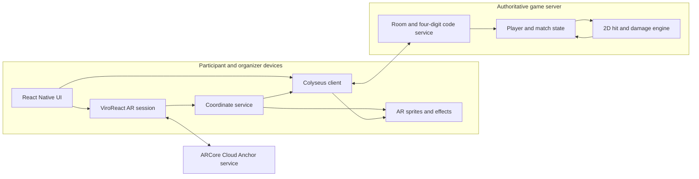
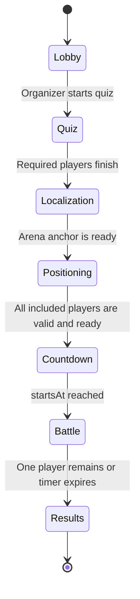

# CodexWars — Retired v1 PRD/TDD

> **Do not implement from this document.** It records the pre-marker, Cloud Anchor design and is retained only for historical context. The approved requirements are in `PRD.md` v2.2; the active technical specifications are `BUILD_SPEC.md` v1.2, `ARCHITECTURE.md` v1.0, and `docs/AR_IMPLEMENTATION_SPEC.md`. P0 now requires both Android and iOS.

## Product Requirements Document and Technical Design Document

**Document status:** Retired v1 draft — superseded
**Target build window:** 5–6 hours  
**Team size:** 4 developers  
**Target platforms:** Android and iOS, with Android-only as the hackathon fallback  
**Maximum supported participants:** 12 stationary players per arena  

---

## 1. Executive summary

CodexWars is a multiplayer educational AR game that converts quiz performance into powers for a short, stationary classroom battle.

An organizer creates a four-digit room, runs a quiz, and establishes a shared AR arena by scanning the floor. Participants join with the room code, complete the quiz, choose a character, resolve the shared arena, stand anywhere within its boundary, and lock their position.

During the battle, participants remain stationary. They may rotate and point their phones toward other players, but may not walk. Every player is represented as a fixed circle on a shared two-dimensional floor coordinate system. The phone supplies an aiming direction, and an authoritative multiplayer server determines which hitbox is intersected and applies damage.

The AR view provides the spectacle—character sprites, health bars, crosshairs, projectiles, impacts, sound and the winner—while the combat simulation remains simple two-dimensional geometry.

---

## 2. Problem statement

Workshop and classroom quizzes often become passive scoreboards. They verify recall but do not provide a memorable reward or shared conclusion to the learning session.

CodexWars makes correct answers immediately meaningful. Quiz results grant battle resources such as shields, energy or special attacks. The session ends with a short AR game that reinforces participation and gives the group a playful shared experience.

---

## 3. Product goals

1. Make workshop quizzes more engaging without replacing the learning activity.
2. Create an understandable connection between correct answers and in-game powers.
3. Deliver a memorable multiplayer AR moment using participants' existing phones.
4. Support up to 12 stationary participants in one physical arena.
5. Avoid facial recognition, wearable markers and QR-based joining.
6. Keep combat deterministic and lightweight by simulating it on a two-dimensional floor plane.
7. Produce a complete hackathon demo on 3–4 physical devices while keeping the model extensible to 12.

## 4. Non-goals for the hackathon MVP

- Walking or continuous player movement during combat
- Facial or body identity recognition
- Full 3D animated character rigs
- Physics-based 3D projectiles
- Room mesh reconstruction
- Tournament brackets
- More than one simultaneous arena
- Production authentication and account recovery
- Persistent match history and analytics
- User-generated character models
- Anti-cheat suitable for a public competitive game

---

## 5. Users and roles

### 5.1 Organizer

The workshop facilitator who:

- Creates the CodexWars room
- Configures or selects the quiz
- Establishes the AR arena
- Monitors participant readiness
- Starts and ends the battle
- Views the winner and final standings

### 5.2 Participant

A workshop attendee who:

- Joins with a four-digit code
- Answers the quiz
- Selects a character and color
- Resolves the shared arena
- Locks a valid physical position
- Aims and attacks while remaining stationary

---

## 6. Core product assumptions

- All participants are physically present in the same well-lit room.
- All active phones have internet access.
- Each phone supports ARKit or ARCore.
- All devices successfully resolve one shared Cloud Anchor.
- Players select a position and remain approximately stationary during the battle.
- Phone rotation is unrestricted; translation is restricted by the game rules.
- Participants hold phones near chest height while aiming.
- The organizer can enforce minimum physical spacing and safe behavior.

---

## 7. End-to-end experience

### 7.1 Organizer flow

1. Open CodexWars and choose **Create War**.
2. Receive a unique four-digit room code.
3. Select the demo quiz or enter a small set of questions.
4. Open **Create Arena**.
5. Scan the floor and surrounding area until AR tracking is stable.
6. Tap the floor to place the arena origin.
7. Host the origin as a shared Cloud Anchor.
8. Select an arena radius or boundary.
9. Wait for participants to join, complete the quiz, resolve the anchor and lock positions.
10. Review the organizer minimap and readiness list.
11. Press **Start Battle** when all required players are ready.
12. Observe battle state and final standings.

### 7.2 Participant flow

1. Open CodexWars and choose **Join War**.
2. Enter the four-digit room code and a display name.
3. Complete the quiz.
4. Receive powers based on correct answers.
5. Choose a 2D character sprite and color.
6. Open the AR arena and scan the organizer's area until the shared anchor resolves.
7. Stand anywhere valid inside the arena.
8. Press **Lock My Position**.
9. Adjust position if it is invalid or too close to another participant.
10. Press **Ready**.
11. On battle start, rotate in place and point the camera toward opponents.
12. Fire attacks using the on-screen controls.
13. See damage, health, elimination and winner feedback.

---

## 8. Gameplay rules

### 8.1 Arena

- The arena is a two-dimensional X/Z plane derived from a shared AR anchor.
- The organizer defines a circular boundary for the MVP.
- Recommended radius: 3–6 metres, depending on the room.
- Maximum active participants: 12.
- Recommended minimum spacing: 1.2–1.5 metres.

### 8.2 Positioning

- A player's position is recorded once before the battle.
- Only the anchor-relative X and Z coordinates are stored.
- Players may rotate but must not deliberately walk after locking.
- The MVP relies on instruction rather than automatic movement penalties.
- A later version may warn when the phone moves beyond a configured tolerance.

### 8.3 Targeting

- The center of the camera is the aiming reticle.
- The phone's forward direction is projected onto the shared floor plane.
- Each opponent has a circular two-dimensional hitbox.
- The first valid hitbox intersected by the attack ray is the target.
- A highlighted reticle and target name provide aim assistance.

### 8.4 Health and elimination

- Every player begins with 100 HP.
- A player at 0 HP is eliminated and cannot attack.
- Eliminated players remain in a spectator state.
- The battle ends when one player remains or the timer expires.
- If the timer expires, the highest remaining HP wins.
- Equal HP triggers a short sudden-death period or uses quiz score as the final MVP tie-breaker.

### 8.5 Quiz rewards

Suggested MVP reward mapping:

| Correct answers | Reward |
|---:|---|
| 0 | Basic attack only |
| 1 | +10 starting shield |
| 2 | +1 fireball charge |
| 3 | +20 starting shield and +1 fireball charge |

All players retain the same base HP so the quiz provides an advantage without completely deciding the battle.

### 8.6 MVP weapons

| Weapon | Range | Ray width | Damage | Additional rule |
|---|---:|---:|---:|---|
| Basic bolt | 8 m | 0.35 m | 10 | Short cooldown, unlimited |
| Fireball | 7 m | 0.55 m | 20 | Limited charges |
| Shield | N/A | N/A | N/A | Absorbs damage before HP |

Values are tunable constants rather than hard-coded gameplay logic.

---

## 9. Feature scope

### 9.1 P0 — required hackathon vertical slice

#### Room and lobby

- Organizer creates a four-digit room
- Participant joins using code and display name
- Live participant list
- Connection and ready status
- Room capacity enforcement up to 12

#### Quiz

- Three fixed multiple-choice questions
- Correct-answer scoring
- Deterministic reward calculation
- Quiz completion status visible to organizer

#### Shared AR arena

- Organizer places one floor anchor
- Organizer hosts a cross-platform Cloud Anchor
- Participants resolve the anchor
- Tracking/localization status
- Circular arena boundary

#### Position reservation

- Participant locks anchor-relative X/Z position
- Server validates boundary and minimum spacing
- Participant may unlock before battle start
- Organizer sees all players on a top-down minimap

#### Battle

- Synchronized countdown and start time
- Camera crosshair
- Aim direction projected to floor plane
- Server-authoritative two-dimensional hit testing
- Basic attack
- HP and shield
- Damage events and cooldown
- Elimination
- Winner determination

#### Feedback

- Target name and HP
- Crosshair locked/unlocked state
- Simple projectile or flash effect
- Hit effect
- Sound or haptic feedback
- Winner screen

### 9.2 P1 — add only after the complete P0 flow works

- Fireball special attack
- Three character sprites
- Character color selection
- Participant spectator view
- Automatic tracking-loss pause
- Organizer force-remove or reset player
- iOS support if the initial Cloud Anchor spike succeeds

### 9.3 P2 — post-hackathon

- Organizer-authored quizzes
- AI-generated quiz questions from workshop notes
- Tournament mode
- Multiple arenas
- Movement detection and enforcement
- Teams
- Additional powers and status effects
- Authentication and profiles
- Match history and leaderboards
- Analytics for learning outcomes
- Production-grade abuse prevention

---

## 10. Functional requirements and acceptance criteria

### FR-1: Create room

The organizer can create a room and receive an unambiguous active four-digit code.

**Acceptance criteria:**

- Code contains exactly four digits.
- Active codes do not collide.
- The room expires automatically after the event window.
- Organizer is assigned host privileges.

### FR-2: Join room

A participant can join an open room using the code and a display name.

**Acceptance criteria:**

- Invalid or expired codes return a clear error.
- Duplicate display names are handled with a suffix or rejection.
- A thirteenth participant is rejected when capacity is 12.

### FR-3: Host and resolve arena

The organizer can host an arena anchor and participants can resolve it.

**Acceptance criteria:**

- The Cloud Anchor ID is stored against the room.
- Each client reports localization state.
- Battle start is blocked for unlocalized participants.
- A tracking error provides a retry action.

### FR-4: Lock position

A localized participant can reserve an arbitrary valid point in the arena.

**Acceptance criteria:**

- Position is stored in anchor-relative X/Z coordinates.
- Position is rejected outside the boundary.
- Position is rejected when it violates minimum spacing.
- Locked positions appear correctly on the organizer minimap.

### FR-5: Start battle

The organizer can start only when every included participant is ready.

**Acceptance criteria:**

- Each included player is connected, localized, positioned, quiz-complete and ready.
- Server emits a future `startsAt` timestamp.
- All clients display a synchronized countdown.

### FR-6: Resolve an attack

The server determines the target and applies damage.

**Acceptance criteria:**

- Client sends weapon and aim direction, not a trusted target ID.
- Server rejects attacks during cooldown or before the start time.
- Server selects the nearest valid target intersecting the ray.
- Shield absorbs damage before HP.
- All clients receive the authoritative result.

### FR-7: Complete battle

The server determines and announces the winner.

**Acceptance criteria:**

- Eliminated players cannot attack.
- Battle ends when one player remains or time expires.
- All clients show the same winner.
- Organizer can return the room to results state.

---

## 11. Non-functional requirements

### Performance

- Target 30 FPS or better on supported devices.
- Use low-resolution sprites and pooled effects.
- Render detailed AR labels only for players in or near the camera view.
- Attack events should feel responsive below approximately 250 ms round-trip latency.

### Reliability

- Reconnect a participant to the same player record when possible.
- Treat the server as authoritative for readiness, combat and results.
- Surface AR tracking loss immediately.
- Preserve room state during a temporary client disconnect.

### Safety and privacy

- Do not record or upload the camera feed.
- Do not use facial recognition.
- Explain that the camera is used for AR tracking.
- Require stationary play and minimum spacing.
- Use fantasy powers rather than realistic weapon imagery for younger audiences.

### Accessibility

- Do not communicate target lock using color alone.
- Pair visual hit feedback with sound or haptics.
- Provide readable text over variable camera backgrounds.
- Allow the organizer to exclude a participant from combat without removing quiz participation.

---

# Technical Design Document

## 12. Selected technology stack

| Concern | Selected technology | Reason |
|---|---|---|
| Mobile application | React Native + TypeScript | Shared Android/iOS code and fast UI development |
| Native build workflow | Expo development build/prebuild | Easier configuration while supporting native AR modules |
| AR rendering | `@reactvision/react-viro` | Open-source React Native AR renderer using ARCore/ARKit |
| Shared coordinate origin | Google ARCore Cloud Anchors through ViroReact | Cross-platform shared spatial localization |
| Multiplayer server | Colyseus on Node.js/TypeScript | Open-source rooms, state sync and authoritative server logic |
| Persistence | In-memory for hackathon; PostgreSQL later | Persistence is not required for the demo |
| Client state | React context or Zustand | Lightweight shared UI state |
| Assets | 2D sprites and small effects | Faster and more reliable than animated 3D models |

ViroReact requires a native development build and physical AR-compatible devices. Expo Go and ordinary simulators are not sufficient for the AR experience.

---

## 13. High-level architecture



### Architectural principle

AR establishes a common coordinate system and renders feedback. It does not decide combat. The Colyseus server owns player positions, attack validation, damage, elimination and results.

---

## 14. Coordinate systems

Each phone begins with its own local AR world. Resolving the same Cloud Anchor gives each phone a local transform for the common arena origin.

Let:

- `T_local_anchor` be the arena anchor transform in the device's local AR world.
- `p_camera_local` be the current camera position in the device's local AR world.
- `f_camera_local` be the current camera forward vector.

### 14.1 Locking a player position

Convert the camera position into anchor coordinates:

```text
p_camera_anchor = inverse(T_local_anchor) × p_camera_local
```

Store only:

```text
player.x = p_camera_anchor.x
player.z = p_camera_anchor.z
```

The Y coordinate is intentionally ignored by gameplay.

### 14.2 Converting camera aim

Rotate the camera forward vector into anchor coordinates, then project it onto the floor:

```text
f_anchor = inverseRotation(T_local_anchor) × f_camera_local
aim2D = normalize([f_anchor.x, f_anchor.z])
```

Send the resulting yaw or normalized two-dimensional direction to the server when an attack occurs.

### 14.3 Rendering another player

Convert the stored anchor-relative position back into the local AR world:

```text
p_target_local = T_local_anchor × [target.x, spriteHeight, target.z]
```

Render a billboard sprite, label and health bar at `p_target_local`.

---

## 15. Server-side hit detection

The server treats players as circles on the X/Z floor plane.

For attacker position `A`, normalized direction `D`, and target position `T`:

```text
toTarget = T - A
distanceForward = dot(toTarget, D)
perpendicularDistance = abs(cross2D(toTarget, D))
```

The target is eligible when:

```text
distanceForward > 0
distanceForward <= weapon.range
perpendicularDistance <= target.hitRadius + weapon.rayRadius
```

If multiple targets are eligible, select the target with the smallest positive `distanceForward`.

### Reference pseudocode

```ts
function resolveAttack(
  attacker: PlayerState,
  direction: Vec2,
  weapon: WeaponConfig,
  players: PlayerState[],
): PlayerState | null {
  let selected: PlayerState | null = null;
  let nearestDistance = Number.POSITIVE_INFINITY;

  for (const target of players) {
    if (target.id === attacker.id || target.hp <= 0) continue;

    const delta = subtract(target.position, attacker.position);
    const forward = dot(delta, direction);
    if (forward <= 0 || forward > weapon.range) continue;

    const lateral = Math.abs(cross2D(delta, direction));
    const allowed = target.hitRadius + weapon.rayRadius;
    if (lateral > allowed) continue;

    if (forward < nearestDistance) {
      nearestDistance = forward;
      selected = target;
    }
  }

  return selected;
}
```

### Damage order

```text
validated damage
    → subtract from shield
    → apply overflow to HP
    → clamp HP to zero
    → mark elimination
    → evaluate match completion
```

---

## 16. Data model

### 16.1 Arena

```ts
type ArenaState = {
  cloudAnchorId: string | null;
  radiusMeters: number;
  minimumSpacingMeters: number;
  status: "unconfigured" | "hosting" | "ready" | "error";
};
```

### 16.2 Player

```ts
type PlayerState = {
  id: string;
  sessionId: string;
  displayName: string;
  role: "organizer" | "participant";
  connected: boolean;
  localized: boolean;
  quizCompleted: boolean;
  quizScore: number;
  characterId: string;
  characterColor: string;
  position: { x: number; z: number } | null;
  hitRadius: number;
  ready: boolean;
  hp: number;
  shield: number;
  fireballCharges: number;
  nextAttackAt: number;
  eliminated: boolean;
};
```

### 16.3 Room

```ts
type RoomState = {
  code: string;
  phase:
    | "lobby"
    | "quiz"
    | "localization"
    | "positioning"
    | "countdown"
    | "battle"
    | "results";
  arena: ArenaState;
  players: Map<string, PlayerState>;
  startsAt: number | null;
  endsAt: number | null;
  winnerId: string | null;
};
```

---

## 17. Client-server events

| Direction | Event | Important fields |
|---|---|---|
| Client → server | `create_room` | organizer name |
| Client → server | `join_room` | code, display name |
| Organizer → server | `anchor_hosted` | cloud anchor ID, radius |
| Client → server | `localization_changed` | localized, tracking status |
| Client → server | `quiz_submitted` | selected answers |
| Client → server | `lock_position` | anchor-relative x, z |
| Client → server | `unlock_position` | none |
| Client → server | `ready_changed` | ready |
| Organizer → server | `start_battle` | none |
| Client → server | `attack` | weapon ID, aim x/z or yaw, client timestamp |
| Server → clients | `attack_resolved` | attacker, target, damage, remaining shield/HP |
| Server → clients | `player_eliminated` | player ID |
| Server → clients | `battle_completed` | winner ID, standings |

The server ignores a client-provided target ID for damage authority. A client may send its predicted target only for diagnostics.

---

## 18. Match state machine



### Start invariant

The server permits `Positioning → Countdown` only when every included participant satisfies:

```text
connected
AND localized
AND quizCompleted
AND position != null
AND ready
AND not organizer
```

---

## 19. Client screen inventory

### Organizer screens

1. Home
2. Create room
3. Room code and participant lobby
4. Quiz control
5. Arena creation and anchor status
6. Organizer minimap and readiness
7. Battle control/status
8. Results

### Participant screens

1. Home
2. Join by four-digit code
3. Quiz
4. Reward summary
5. Character selection
6. Arena localization
7. Position lock and ready
8. AR battle
9. Eliminated/spectator state
10. Results

For the hackathon, several screens may be combined to reduce navigation work.

---

## 20. Error and recovery behavior

| Failure | MVP behavior |
|---|---|
| Invalid room code | Show inline error and retain entered name |
| Cloud Anchor hosting fails | Organizer retries after scanning more of the room |
| Participant cannot resolve anchor | Show scan guidance and retry |
| Tracking becomes limited before start | Mark participant unready |
| Position outside arena | Reject and show direction toward valid area |
| Position overlaps another player | Reject and show required spacing |
| Participant disconnects before start | Block start or organizer removes them |
| Participant disconnects during battle | Preserve state briefly, then eliminate after timeout |
| Server disconnects | Freeze controls and show reconnecting state |
| iOS native build fails during hackathon | Demonstrate Android and retain cross-platform design |

---

## 21. Cross-platform build requirements

### Android

- ARCore-supported physical phone
- Camera and internet permissions
- Google Cloud API key configured for ARCore
- AR mode enabled in the ViroReact config plugin

### iOS

- Mac with Xcode
- ARKit-compatible physical iPhone
- Working Apple signing/provisioning
- Camera permission description
- ARCore Cloud Anchors pods configured by ViroReact/Expo prebuild
- Google Cloud API key configured in the iOS project

### First technical gate

Within the first 60–90 minutes, prove that:

1. An Android device hosts an anchor with a visible object.
2. The Cloud Anchor ID travels through the game room.
3. An iPhone resolves the same anchor.
4. Both devices see the object in the same physical location.

If this gate fails, continue Android-only rather than consuming the entire hackathon on native configuration.

---

## 22. Testing strategy

### Unit tests

- Two-dimensional vector normalization
- Ray/circle hit eligibility
- Nearest-target selection
- Shield and HP damage order
- Position boundary validation
- Minimum-spacing validation
- Quiz reward mapping
- Winner and timeout rules

### Integration tests

- Create and join room
- Host and distribute Cloud Anchor ID
- Resolve anchor and lock position
- Ready-state start gating
- Attack request to synchronized damage result
- Elimination to winner transition
- Reconnection to existing player record

### Physical-device scenarios

- Two phones facing each other
- Three players with two roughly aligned along the aim ray
- Players near arena boundary
- Temporary AR tracking loss
- Android host with iOS resolver
- iOS host with Android resolver, if time permits
- Three or four devices simultaneously

The data model and algorithms must support 12 players, but the hackathon demo does not require testing 12 physical phones.

---

## 23. Six-hour implementation plan

### Developer A — AR and coordinate systems

- Set up ViroReact development build
- Host and resolve Cloud Anchor
- Expose anchor and camera transforms
- Convert camera position/forward vector into anchor coordinates
- Render anchor-relative sprites

### Developer B — multiplayer and combat server

- Create Colyseus room and four-digit code mapping
- Implement player state and start invariant
- Validate positions
- Implement hit detection, damage and winner logic

### Developer C — battle client

- Implement crosshair and target prediction
- Build attack controls and cooldown feedback
- Render sprites, health, projectiles and hit effects
- Handle elimination and results

### Developer D — product flow and organizer UI

- Build join, lobby and quiz screens
- Implement reward mapping and character choice
- Build organizer readiness list and minimap
- Own integration checklist, assets and demo rehearsal

### Timeline

| Time | Goal |
|---|---|
| 0:00–0:30 | Starter project builds on physical devices; shared types agreed |
| 0:30–1:30 | Cross-device Cloud Anchor spike and go/no-go decision |
| 1:30–3:30 | Parallel AR, server, battle and product-flow implementation |
| 3:30–4:30 | Complete vertical-slice integration |
| 4:30–5:30 | Multi-device testing and critical fixes |
| 5:30–6:00 | Demo setup, rehearsal and fallback preparation |

No P1 feature begins until the complete P0 path works on at least two physical phones.

---

## 24. Demo success criteria

The hackathon demo is successful when the audience sees:

1. Organizer creates a CodexWars room and displays its code.
2. At least two participants join and answer the quiz.
3. Organizer establishes the arena.
4. Participants localize and lock different floor positions.
5. Organizer sees them on the minimap and starts the battle.
6. One participant points at another and receives target-lock feedback.
7. An attack produces synchronized damage on both phones.
8. A player is eliminated and a winner is shown consistently.

The presentation should state that the implementation is data-modelled for 12 stationary players even if the live demo uses 3–4 devices.

---

## 25. Key risks and mitigations

| Risk | Impact | Mitigation |
|---|---|---|
| Cross-platform Cloud Anchor setup fails | Critical | Run first; fall back to Android-only |
| Environment lacks visual features | High | Use a textured, well-lit area and guided scanning |
| Anchor alignment varies between devices | High | Use generous hitboxes and aim assistance |
| Native iOS signing or pods fail | High | Verify before feature work; keep Android demo path |
| Too many parallel features | High | Enforce P0 completion before P1 |
| Network latency | Medium | Fixed positions and discrete server-authoritative attacks |
| Physical crowding with 12 players | Medium | Minimum spacing, arena capacity validation and stationary rules |
| Camera background makes UI unreadable | Medium | High-contrast panels, outlines and scrims |

---

## 26. Future architecture extensions

The following can be added without replacing the core two-dimensional combat engine:

- Team ownership and friendly-fire rules
- Tournament brackets using multiple four-player heats
- Multiple Cloud Anchors for multiple physical arenas
- AI-generated quiz content
- Moving participants by periodically publishing anchor-relative poses
- Replay events using the authoritative attack log
- Persistent profiles and cosmetics
- Classroom analytics and learning reports

The shared floor plane remains the stable gameplay abstraction even if the AR presentation becomes richer.
